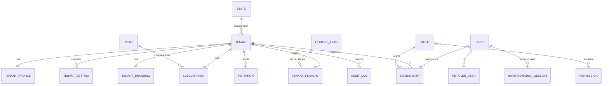
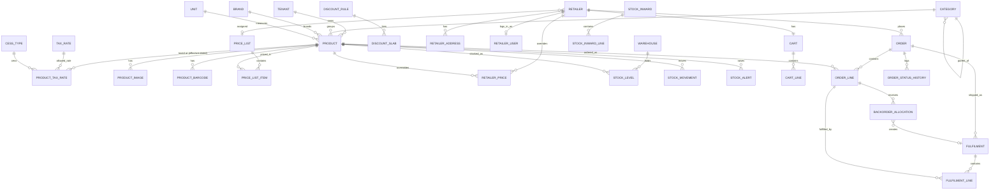
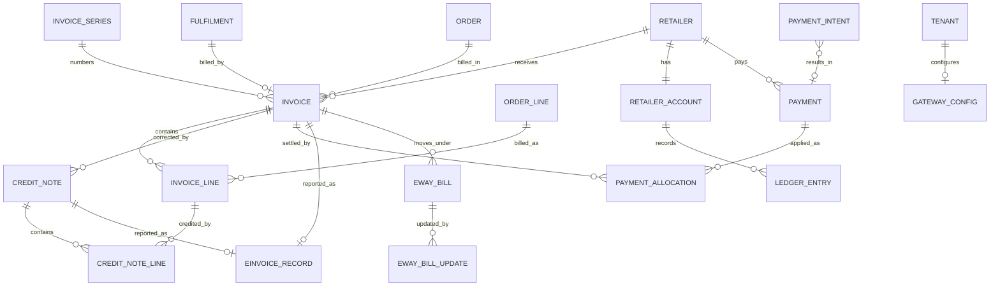
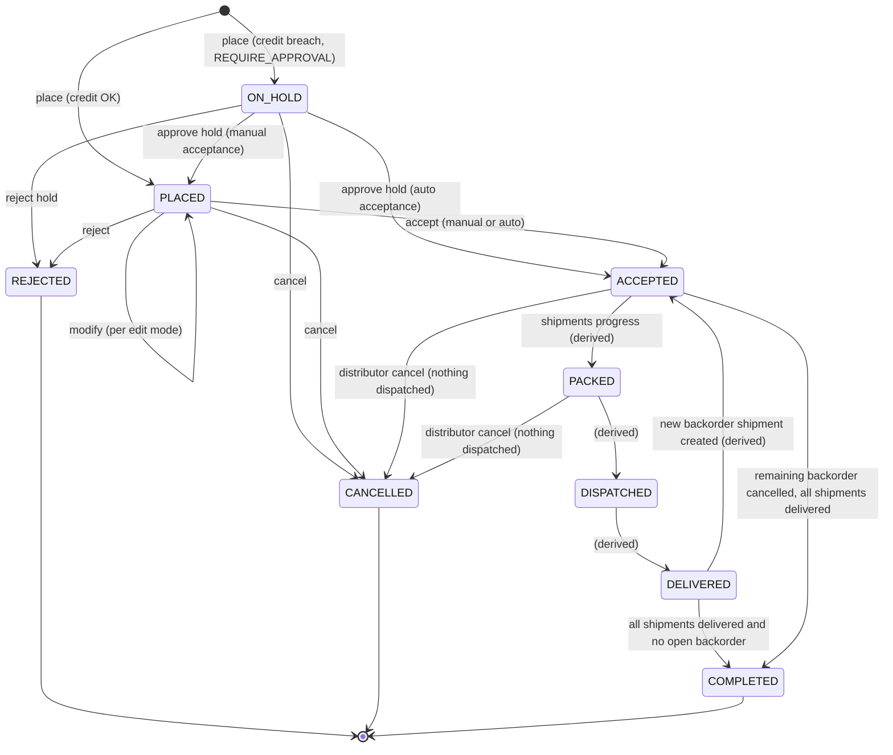
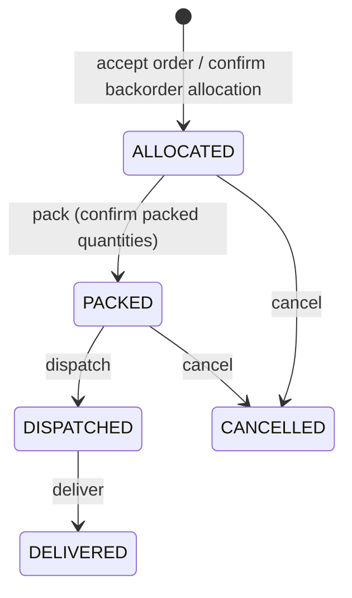
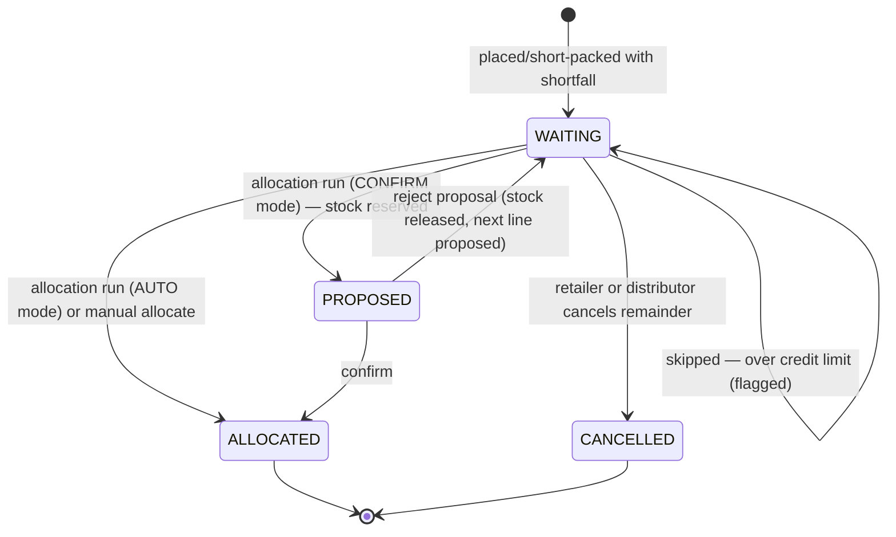
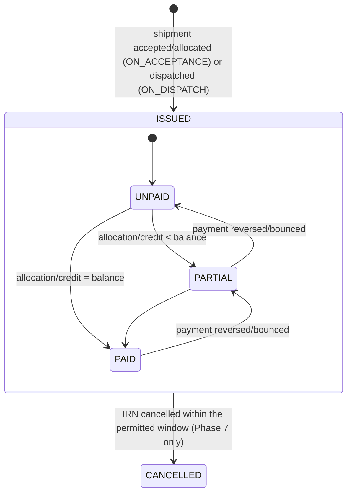
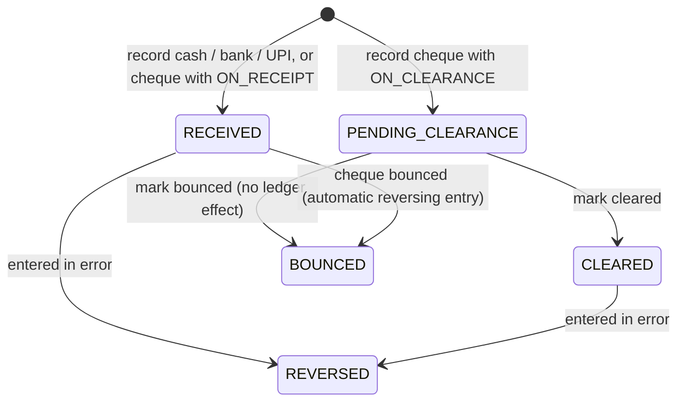
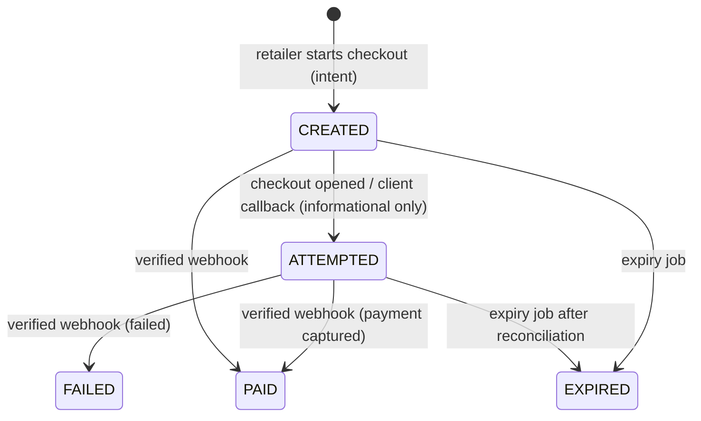

# PLAN.md — Master Engineering Plan (v1)

Status: **v1.3 — product-owner decisions of 2026-09-24, follow-ups and Phase 1 answers of 2026-09-25 applied (see §10). Phase 0 complete (2026-09-25); Phase 1 complete, in review.**
Source of truth for *what*: `docs/PROJECT_SPEC.md`. Rules for *how*: `CLAUDE.md`.
Where this plan and the spec disagree, the spec wins until the spec is updated.

Contents
1. Product understanding, ambiguities & risks
2. Data model (by Django app) + ER diagrams
3. REST API surface v1
4. State machines (order, fulfilment/backorder, invoice, ledger, payment)
5. Stock reservation & backorder allocation algorithms
6. Tax calculation algorithm + worked examples
7. Frontend route map
8. Phase-by-phase task breakdown
9. Settings catalogue
10. Decisions record & open questions

---

## 1. Product understanding, ambiguities & risks

### 1.1 The product in 10 lines
1. A multi-tenant SaaS we operate (Super Admin) for Indian B2B distributors (tenants).
2. Each distributor gets an isolated, brandable workspace on `{slug}.<domain>`.
3. Distributors manage a catalog (up to 20k products), stock in a default warehouse, and ~500 retailers each.
4. Retailers (non-technical shop owners, one distributor each) log in with mobile + OTP on a mobile-first PWA.
5. Retailers see only their distributor's catalog with server-resolved prices (price list → override → best discount).
6. Orders reserve available stock atomically; any shortfall becomes a backorder that is filled FIFO when stock arrives.
7. Credit control (BLOCK or hold for approval) protects the distributor's receivables.
8. Accepted/allocated quantities are invoiced with correct GST (CGST+SGST vs IGST), gapless per-FY numbering and PDFs.
9. An append-only per-retailer ledger tracks invoices, payments (offline first, online via the tenant's own gateway later) and credit notes.
10. Notifications (in-app, email, WhatsApp), reports, e-invoice/e-way bill and AI features are layered on behind per-tenant feature flags.

### 1.2 Ambiguities & risks — resolutions (decided 2026-09-24)

Legend:
- **FIXED** = a legal or data-integrity rule, fixed in code.
- **⚙** `key` = a configurable setting (see §9 Settings catalogue), with its default.
- **[D]** = technical decision (ADR in `docs/DECISIONS.md`).
- **NEW Q** = a follow-up question in §10.2.

#### Money & pricing
| # | Topic | Resolution |
|---|---|---|
| M1 | Precision of discounted unit prices | Line-level math: `gross = round(qty × unit_price)`, `discount = round(gross × pct)`, `taxable = gross − discount`. The net unit price is informational only. **[D]** |
| M2 | Flat discount basis | **FIXED:** per unit (`round(qty × flat)`, capped at gross). |
| M3 | Quantity slabs basis | **FIXED:** line quantity of that product. |
| M4 | Category discounts and sub-categories | **FIXED:** a category rule applies to all its descendants. |
| M5 | "Single best rule" tie-break | Highest discount amount → most specific audience (retailer > price list > all) → most specific scope (product > deeper category > brand > all) → newest rule. **[D]** |
| M6 | GST-inclusive pricing | ⚙ `tax.prices_include_gst` (default **false**). Inclusive mode: the discount applies to the inclusive amount, and taxable is backed out per line. A **±₹0.01 line tolerance** is accepted and absorbed by the round-off (§6 Ex 7). The price basis of an order line follows the **order's** snapshot, even if the setting changes before invoicing (ADR-016). |
| M7 | Minimum order value | ⚙ `orders.min_order_value` (default none) and ⚙ `orders.min_order_value_basis` (default **INCL_GST**). Backordered items **count** (FIXED). |
| M8 | Backorder billing price | ⚙ `backorders.billing_price` = ORIGINAL (default) \| CURRENT. CURRENT = price re-resolved when the backorder shipment is created (allocation confirmed) and stored on the fulfilment line. **If the price increased** vs the order price: the retailer is notified and may **cancel that quantity themselves until the shipment is packed** (ADR-021). Unchanged or lower: notification only. |
| M9 | Unit cost precision | `UnitCost = Decimal(14,4)` for avg/unit cost only. All monetary totals are `Decimal(14,2)`. **[D]** |
| M10 | Price changed between cart and placement | Placement re-resolves prices. If the total differs from `expected_total` → `PRICE_CHANGED` + fresh cart, so the retailer re-confirms. **[D]** |
| M11 | Selling price above MRP | Warning only (form + import report). **[D]** |

#### GST / invoicing
| # | Topic | Resolution |
|---|---|---|
| G1 | GST rate set | Platform master table `TaxRate`. Seed **active**: 0, 0.25, 3, 5, 18, 40 (GST 2.0, effective 22-Sep-2025). Seed **inactive**: 12, 28 (kept for historical invoices and credit notes). Cess field kept, with a platform `CessType` table. Optional platform `HsnRateHint` mapping (suggestions and import warnings only). |
| G1b | Product tax rates over time | **Effective-dated** `ProductTaxRate(product, gst_rate, cess_type, cess_rate, effective_from)`. Changes can be scheduled in advance. The rate for any date comes from one selector, `catalog.selectors.tax_rate_on(product, date)`. With GST-inclusive prices, the inclusive price stays and the taxable value changes. A daily job raises a **7-day advance warning** (dashboard card + `tax.rate_change_upcoming` notification) listing affected products (ADR-022). |
| G2 | Rate change between order and invoice | **FIXED:** the invoice uses the rate valid on the **invoice date**. The order line keeps its order-date rate as an estimate. The invoice line sets `rate_differs_from_order`, and the distributor sees a warning. |
| G3 | Place of supply | **FIXED:** shipping address state, defaulting to the retailer's registered state. |
| G4 | CGST/SGST split | **FIXED:** each half computed and rounded independently from taxable, so they are always equal. **[D]** |
| G5 | Rounding | Defaults: ⚙ `tax.component_rounding` = HALF_UP (per line, per component) and ⚙ `invoicing.round_to_rupee` = true with ⚙ `invoicing.round_off_method` = NEAREST (half-up). Vetted method lists only. **ADR-009 status: "Accepted — pending CA confirmation" (before Phase 5).** |
| G6 | FY boundary | **FIXED:** `invoice_date` and FY are computed in IST. **[D]** |
| G7 | Invoice number format | **FIXED:** ≤ 16 chars, `A–Z 0–9 / -`, gapless per FY. The prefix/format is configurable within these limits (per `InvoiceSeries`). |
| G8 | Gapless under failure | Number allocated in the issuing transaction from a locked series row. Invoices are never deleted. **[D]** |
| G9 | When is the invoice issued? | ⚙ `invoicing.timing` = **ON_DISPATCH (default)** \| ON_ACCEPTANCE. *Dispatch mode:* the invoice covers the **packed** quantity at dispatch. A short-packed remainder → backorder if `backorders.enabled`, else cancelled + retailer notified. *Acceptance mode:* invoice at acceptance/allocation, and short packs are corrected via a `SHORT_SUPPLY` credit note (remainder → backorder or cancelled, same rule). The **e-way bill is always generated from the invoice at dispatch.** ⚙ `orders.send_confirmation_on_accept` (default **true**) sends an *Order Confirmation* document (items, prices, tax estimate; not a tax invoice) at acceptance. The timing applies per order from its snapshot. |
| G10 | Invoice cancellation | **FIXED:** issued invoices are never edited or cancelled; corrections go through credit notes. The only exception is IRN cancellation within the permitted window (Phase 7). |
| G11 | Tenant registration | **FIXED:** GSTIN mandatory for every tenant. ⚙ `tax.registration_type` has only `REGULAR` enabled; `COMPOSITION` (bill of supply) is reserved and disabled. |
| G12 | Unregistered retailers (B2C) | Supported, with no e-invoice. B2CL thresholds to be verified before the Phase 8 reports. **[D]** |
| G13 | HSN digits | ⚙ `tax.hsn_min_digits` (default 4). **[D]** |
| G14 | Cess | Cess type + rate on `ProductTaxRate`. The engine supports percentage cess; other cess methods are reserved. **[D]** |
| G15 | Partial credit-note drift | Prorate + remainder rule (§6.5). **[D]** |

#### Stock
| # | Topic | Resolution |
|---|---|---|
| S1 | Credit-hold orders reserve stock? | ⚙ `credit.hold_reserves_stock` (default **true**). If false, held quantities sit in `qty_pending` and are reserved at approval (any shortfall follows the backorder/insufficient-stock rules). |
| S2 | Unaccepted orders | **FIXED:** never expire. ⚙ `orders.pending_alert_hours` (default **24**) raises a dashboard alert. |
| S3 | Short stock at checkout, backorders off | ⚙ `orders.insufficient_stock_action` = **FAIL (default)** \| PLACE_AVAILABLE. FAIL returns per-line shortfalls + a one-tap "reduce to available". PLACE_AVAILABLE places the in-stock part and cancels the rest with a clear message. |
| S4 | Adjust-out below reserved | Blocked (`STOCK_RESERVED`). **[D]** |
| S5 | Pack conversions | Stock and orders are in the base unit; packs are used for entry and display. **[D]** |
| S6 | StockLevel must exist before locking | Created with the product; `ON CONFLICT DO NOTHING` safety net. **[D]** |
| S7 | Inward corrections | DRAFT → POSTED (immutable); corrections by adjustment. **[D]** |
| S8 | Valuation | Weighted-average cost. **[D]** |

#### Orders & backorders
| # | Topic | Resolution |
|---|---|---|
| B1 | Order vs shipments | **Accepted:** every shipment (initial + each backorder allocation) is a `Fulfilment` with its own packing, dispatch, invoice and status. Order status adds **COMPLETED** = all shipments delivered **and** no open backorder quantity (§4.1). |
| B2 | Priority when stock arrives | **FIXED:** FIFO. Older backorders are served before new orders. Proposals awaiting confirmation **hold the stock**. Allocation happens in the same transaction as the stock inward. |
| B3 | Eligibility | **FIXED:** only accepted orders (and later statuses) are eligible for allocation. |
| B4 | Credit at allocation | **FIXED:** re-checked. Retailers over their limit are skipped and flagged (`SKIPPED_CREDIT`). |
| B5 | Edits before acceptance | ⚙ `orders.pre_acceptance_edit_mode` = **REDUCE_ONLY (default)** \| FULL_EDIT (increase qty / add lines at current prices, reserved or backordered per the normal rules). An edit that would breach the credit limit is **refused** (`CREDIT_LIMIT_EXCEEDED`) unless a user with `credit.manage` applies an **audited override in the same flow** (ADR-022). The retailer is **always** notified with a diff. |
| B6 | Retailer cancellation | Before acceptance only. The open backorder remainder can be cancelled any time. **[D]** |
| B7 | Staff orders on behalf | ⚙ `orders.staff_can_place_on_behalf` (default **true**), permission `orders.create_on_behalf`. `Order.placed_by` + `placed_via` record who placed it. |
| B8 | Sales staff visibility | ⚙ `orders.sales_visibility` = **ALL (default)** \| ASSIGNED_RETAILERS (applies to orders, retailers, and "own retailers" reports). |
| B9 | Allocation permission | Permission **`orders.allocate_backorder`**, granted by default to Owner/Admin, Manager and Warehouse. |
| B10 | Idempotency | Unique per (user, endpoint, key), 24 h retention, request-hash check. **[D]** |

#### Credit control & payments
| # | Topic | Resolution |
|---|---|---|
| C1 | Credit exposure | **FIXED:** `ledger balance + open not-yet-invoiced order value (incl. GST) + this order`. Serialized per retailer via the `RetailerAccount` row lock. |
| C1b | Breach action | ⚙ `credit.breach_action` = **REQUIRE_APPROVAL (default)** \| BLOCK. |
| C2 | Limit semantics | **FIXED:** empty = unlimited; `0` = no credit (every credit order needs approval or is blocked, per `credit.breach_action`). |
| C3 | Overdue blocking | ⚙ `credit.block_overdue_after_days` = **null (off, default)** \| N days. When set, a retailer with any invoice overdue by more than N days hits the breach action. |
| C4 | Advances / overpayments | ⚙ `payments.hold_advances` (default **true**): excess is held as unapplied credit and auto-applied FIFO to future invoices. If false: an offline payment above the outstanding amount is refused (`PAYMENT_EXCEEDS_OUTSTANDING`). A credit note larger than the invoice balance still leaves a credit balance, applied to the next invoice (legally owed) (ADR-022). |
| C5 | Cheques | ⚙ `payments.cheque_credit_timing` = **ON_RECEIPT (default)** \| ON_CLEARANCE. A bounce always produces an automatic reversing entry (ON_RECEIPT) or simply never credits (ON_CLEARANCE). |
| C6 | Opening balances | Ledger `OPENING_BALANCE` via import or adjustment. **[D]** |
| C7 | Hot `RetailerAccount` row | Acceptable (contention is per retailer only). **[D]** |

#### Tenant isolation, identity & security
| # | Topic | Resolution |
|---|---|---|
| T1 | RLS & `SET LOCAL` | Request transaction + `set_config(…, true)`; app role without BYPASSRLS; audited platform alias. **[D]** |
| T2 | Cross-tenant FK injection | Tenant-scoped serializer querysets + service asserts + RLS + URL-conf-driven isolation tests. **[D]** |
| T3 | **Retailer identity (CHANGED)** | Mobile is **unique per tenant**, not platform-wide. Each tenant's retailer is a **separate** retailer + user record with fully separate data. Login happens on the distributor's subdomain. On the generic domain, after OTP verification, if the number matches retailers in more than one active tenant → a "choose your distributor" screen (shown only to the verified phone owner). A distributor is **never** told that a number exists under another tenant (§2.3, ADR-015). |
| T4 | Staff login & hosts | Staff email is globally unique. Staff log in on their tenant subdomain **or** on the generic `<domain>/login` (email + password [+ TOTP]). On the generic domain the tenant is resolved from active memberships, with a chooser if there is more than one → single-use handoff to `{slug}.<domain>`. **Super admin logs in only at `admin.<domain>`**: platform users are refused on other hosts, and staff are refused on the admin host (ADR-020). |
| T5 | Celery/Channels/cache/S3 scoping | Explicit `tenant_id`, per-tenant groups, key prefixes. **[D]** |
| T6 | Suspended tenant | **FIXED:** all staff and retailer logins blocked with a friendly message; data kept; super admin can reactivate. |
| T7 | Impersonation | **UPDATED (ADR-029):** short-lived, non-refreshable, audited token with a banner claim. Sessions start **read-only**; an audited switch to ACT mode needs a reason; credential, staff/role and bank-detail changes are always blocked; session events appear in the tenant's audit log. |
| T8 | `platform` app name | `apps.platform`, always imported with its prefix. **[D]** |
| T9 | Primary keys | UUIDv7. **[D]** |
| T10 | Domain | Platform domain from env `PLATFORM_DOMAIN` (dev: `localhost` → `admin.localhost`, `{slug}.localhost`). Production domain to be supplied before staging. |

#### Reliability & configurability
| # | Topic | Resolution |
|---|---|---|
| R1 | Event delivery | **Accepted:** transactional outbox + sweeper; idempotent consumers. |
| R2 | Deadlocks | **Accepted:** global lock order (§5.1) + `@retry_on_deadlock`. |
| R3 | Webhook tenant resolution | Per-tenant webhook URL token. **[D]** |
| R4 | Large append-only tables | Tenant-led indexes + BRIN; partitioning decided in Phase 8/10. **[D]** |
| R5 | Storage | S3-compatible stand-in in Docker Compose (SeaweedFS, ADR-024; MinIO images are no longer publicly available), used only through the storage adapter. |
| R6 | **Configurability** | A typed settings registry (§9). Orders, invoices and credit notes **snapshot** the settings in effect. Every change is audited. The settings UI is generated from the registry. Tests cover every value of relevant settings. A fresh tenant works on defaults (ADR-016). |

---

## 2. Data model

### 2.0 Conventions
- **Types:** `Money` = `Decimal(14,2)`; `Qty` = `Decimal(14,3)`; `Rate` = `Decimal(6,3)` (percent, e.g. `18.000`, and `0.125` for half of 0.25%); `UnitCost` = `Decimal(14,4)`; `State` = `char(2)` GST state code (e.g. `27`); `Phone` = E.164 `varchar(16)`.
- **Base classes** (in `common`):
  - `BaseModel`: `id UUID pk (uuid7)`, `created_at timestamptz`, `updated_at timestamptz`.
  - `TenantScopedModel(BaseModel)`: `tenant FK→Tenant (PROTECT, indexed)`, `created_by FK→User null`. Default manager `TenantManager` auto-filters by the context tenant and **raises** if no tenant is set (explicit `.unscoped()` exists for audited platform paths only). RLS policy `tenant_id = current_setting('app.current_tenant')::uuid` is created by the `common.migrations.enable_rls(<table>)` operation.
  - `SoftDeleteMixin` (master data only): `is_active bool`, `deleted_at timestamptz null`.
  - `AppendOnlyMixin`: a DB trigger rejects `UPDATE`/`DELETE` (StockMovement, LedgerEntry, AuditLog, OrderStatusHistory, PaymentAllocation, OutboxEvent payload columns).
- The fields `id, tenant, created_at, updated_at, created_by` are **not repeated** below.
- Every tenant index starts with `tenant_id`. `(t, …)` below means `(tenant_id, …)`.
- Enums are `TextChoices` stored as `varchar`.
- **Settings registry** (code, not a table): `apps/platform/registry.py` defines every configurable key (§9). The `TenantSetting` / `PlatformSetting` tables store only overrides.

### 2.1 `common`
| Model | Fields | Constraints / indexes |
|---|---|---|
| **Sequence** (tenant) | `name` (ORDER, GRN, ADJ, FULFILMENT, RECEIPT…), `period` varchar(10) (`2026` or `2025-26`), `next_value` bigint | unique `(t, name, period)`; row locked `FOR UPDATE` for each allocation |
| **IdempotencyRecord** | `tenant` FK null, `user` FK, `endpoint` varchar, `key` varchar(80), `request_hash` char(64), `status` (IN_PROGRESS, DONE), `response_status` int, `response_body` jsonb, `expires_at` | unique `(user, endpoint, key)`; index `expires_at` (purge job) |
| **OutboxEvent** (tenant) | `event_type` varchar (e.g. `order.placed`), `aggregate_type`, `aggregate_id` uuid, `payload` jsonb, `dispatched_at` null, `attempts` int, `last_error` | index `(dispatched_at) where dispatched_at is null`; `(t, created_at)` |

### 2.2 `platform`
| Model | Fields | Constraints / indexes |
|---|---|---|
| **State** (reference) | `code` State pk, `name`, `is_union_territory` | seeded by data migration (all GST state codes) |
| **TaxRate** (master, super admin) | `rate` Rate, `label`, `is_active`, `notes` | unique `rate`; seeded **active** 0, 0.25, 3, 5, 18, 40 and **inactive** 12, 28; an inactive rate cannot be assigned to new `ProductTaxRate` rows but remains valid on historical documents |
| **CessType** (master, super admin) | `code` unique, `name`, `calc_method` (PERCENT; SPECIFIC_PER_UNIT reserved), `is_active` | — |
| **HsnRateHint** (master, optional) | `hsn_prefix` varchar(8), `gst_rate` Rate, `effective_from` date, `description` | unique `(hsn_prefix, effective_from)`; used only for suggestions and import warnings, never to compute tax |
| **Tenant** | `name`, `registration_type` (REGULAR; COMPOSITION reserved, rejected by validation), `slug` (subdomain, `[a-z0-9-]{3,30}`, reserved words blocked), `legal_name`, `gstin` char(15), `pan` char(10), `state` FK→State, `address_line1/2`, `city`, `pincode` char(6), `email`, `phone`, `status` (ONBOARDING, ACTIVE, SUSPENDED), `suspended_reason`, `suspended_at`, `webhook_token` (random, for payment webhooks) | unique `slug`; unique `gstin`; check GSTIN state prefix = `state` (app-level + checksum validator) |
| **TenantProfile** (1:1 tenant) | business *data* (not settings): `invoice_terms` text, `invoice_footer` text, bank: `bank_account_name`, `bank_account_number` (encrypted), `bank_ifsc`, `bank_name`, `bank_branch`, `upi_id`; `signatory_name`, `signatory_image` (file key) | one row per tenant |
| **TenantSetting** (tenant) | `key` varchar (must exist in the code registry), `value` jsonb (validated against the registry type/allowed values), `updated_by` | unique `(t, key)`; **only overrides are stored**, and a missing row = registry default, so a new tenant works with zero rows; every write goes through `platform.services.set_setting()` → audit `settings.changed` with old/new; reads via cached `platform.selectors.get_setting(tenant, key)` (typed) |
| **TenantBranding** (1:1 tenant) | `display_name`, `logo`, `favicon`, `app_icon` (file keys), `primary_color` char(7), `updated_by` (the palette is derived on the client, ADR-028) | check hex format |
| **Plan** | `code` unique, `name`, `price_monthly` Money, `max_retailers` int null, `max_staff` int null, `max_products` int null, `features` jsonb (flag codes), `is_default` bool, `is_active` | partial unique `is_default where true` ("BETA") |
| **Subscription** | `tenant` FK, `plan` FK, `status` (TRIAL, ACTIVE, PAST_DUE, CANCELLED), `starts_at`, `ends_at` null, `is_current` bool | partial unique `(tenant) where is_current` |
| **FeatureFlag** | `code` unique (`payments`, `subscriptions_enforcement`, `einvoice`, `ewaybill`, `whatsapp`, `batches`, `multi_warehouse`, `ai`), `name`, `description`, `default_enabled`, `tenant_toggleable` bool | — |
| **TenantFeature** | `tenant` FK, `flag` FK, `enabled`, `updated_by` | unique `(tenant, flag)`; resolved via a cached `features.is_enabled(tenant, code)` |
| **PlatformSetting** | `key` unique (platform-scope registry keys), `value` jsonb, `updated_by` | same registry validation + audit as TenantSetting |

### 2.3 `accounts`
| Model | Fields | Constraints / indexes |
|---|---|---|
| **User** (`AbstractBaseUser`, `PermissionsMixin`) | `user_type` (PLATFORM, STAFF, RETAILER), `tenant` FK null (**set only for RETAILER users**; one retailer user per tenant account), `email` citext null, `phone` Phone null, `full_name`, `password` (unusable for RETAILER), `is_active`, `is_staff` (Django admin; super admins only), `totp_secret` (encrypted) null, `totp_enabled` bool, `preferred_language` (en, hi, mr), `failed_login_count` int, `locked_until` null, `last_login` | partial unique `email where user_type in ('PLATFORM','STAFF')`; **partial unique `(tenant, phone) where user_type='RETAILER'`** (the same phone may exist in several tenants as unrelated users); checks: PLATFORM/STAFF ⇒ email not null and tenant null; RETAILER ⇒ phone and tenant not null |
| **RecoveryCode** | `user` FK, `code_hash`, `used_at` null | index `user` |
| **Permission** | `code` unique (e.g. `orders.accept`), `module`, `description` | seeded from the code registry `accounts/permissions.py` by migration |
| **Role** | `tenant` FK **null** (null = system role), `code`, `name`, `is_system`, `permissions` M2M→Permission | unique `(tenant, code)` (nulls not distinct); system roles: OWNER, MANAGER, SALES, WAREHOUSE, ACCOUNTS; PLATFORM_ADMIN (platform-level) |
| **Membership** (tenant) | `user` FK, `role` FK, `is_active`, `invited_by` FK null, `joined_at` | unique `(user, tenant)`; index `(t, role)` |
| **Invitation** (tenant) | `email`, `role` FK, `token_hash` char(64) unique, `status` (PENDING, ACCEPTED, REVOKED, EXPIRED), `expires_at`, `accepted_at`, `invited_by` | partial unique `(t, email) where status='PENDING'` |
| **OTPRequest** | `phone`, `tenant` FK null (set when requested on a tenant subdomain; null on the generic domain), `purpose` (LOGIN), `channel` (SMS, WHATSAPP), `code_hash`, `expires_at`, `attempts` int, `consumed_at` null, `ip` inet | index `(phone, created_at desc)`; rate limit (platform settings, ADR-030): 3/10 min per phone, 100/hour per IP (generous because of CGNAT); max 5 verify attempts. The response is identical whether or not the number is known (no enumeration) |
| **AccountChoiceToken** | `phone`, `token_hash`, `candidate_user_ids` uuid[], `expires_at` (5 min), `used_at` | issued after OTP verification on the generic domain when > 1 tenant matches; only lists **active** tenants |
| **ImpersonationSession** | `impersonator` FK→User, `target_user` FK, `tenant` FK, `reason` text (required), `mode` (READ_ONLY, ACT), `act_reason` text null, `act_started_at` null, `started_at`, `ended_at` null, `end_reason` (ENDED, EXPIRED, null), `expires_at`, `ip`, `user_agent` | index `(tenant, started_at)` |
| *(library)* | `rest_framework_simplejwt.token_blacklist` OutstandingToken / BlacklistedToken for refresh-token revocation | — |

### 2.4 `catalog`
| Model | Fields | Constraints / indexes |
|---|---|---|
| **Category** (tenant, soft-delete) | `name`, `slug`, `parent` FK self null, `level` smallint, `sort_order` int, `image` null | check `level between 1 and 3`; unique `(t, parent, lower(name))` (nulls not distinct); index `(t, parent)` |
| **Brand** (tenant, soft-delete) | `name`, `logo` null | unique `(t, lower(name))` |
| **Unit** (tenant) | `code` (PCS, BOX, KG, LTR…), `name`, `allows_decimal` bool, `uqc` (GST Unit Quantity Code, e.g. NOS/KGS/BOX; the list must be verified) | unique `(t, code)`; defaults seeded per tenant |
| **Product** (tenant, soft-delete) | `code` varchar(40), `name` varchar(200), `description`, `category` FK null, `brand` FK null, `unit` FK, `pack_unit` FK→Unit null, `pack_size` Qty null, `hsn_code` varchar(8), *(tax rate lives in `ProductTaxRate`)*, `mrp` Money null, `base_price` Money, `min_order_qty` Qty=1, `order_multiple` Qty=1, `reorder_level` Qty=0, `tags` varchar[] , `search_vector` tsvector (trigger-maintained: name A, code/barcodes A, brand B, tags B, category C) | unique `(t, lower(code))`; checks: `base_price>=0`, `mrp is null or mrp>=0`, `min_order_qty>0`, `order_multiple>0`, `(pack_unit is null) = (pack_size is null)`, `pack_size>0`; GIN `(tenant_id, search_vector)` (btree_gin); GIN trigram on `name` and `code`; `(t, category)`, `(t, brand)`, `(t, is_active, name)` |
| **ProductTaxRate** (tenant, append-only history) | `product` FK, `gst_rate` Rate (must be an active `TaxRate` when created), `cess_type` FK null, `cess_rate` Rate=0, `effective_from` date (IST; may be in the future = scheduled), `reason` | unique `(product, effective_from)`; index `(t, product, effective_from desc)`; the rate for date *d* = row with max `effective_from ≤ d`; a product must have a row with `effective_from ≤ today` to be sellable; changes audited; bulk "schedule rate change" by HSN/category |
| **ProductImage** (tenant) | `product` FK, `original_key`, `variants` jsonb (`thumb/medium/large` keys + dims), `sort_order`, `alt_text`, `status` (PROCESSING, READY, FAILED) | index `(t, product, sort_order)`; upload limit 5 MB, jpeg/png/webp |
| **ProductBarcode** (tenant) | `product` FK, `barcode` varchar(64) | unique `(t, barcode)` |

### 2.5 `pricing`
| Model | Fields | Constraints / indexes |
|---|---|---|
| **PriceList** (tenant, soft-delete) | `name`, `code`, `description` | unique `(t, lower(name))` |
| **PriceListItem** (tenant) | `price_list` FK, `product` FK, `price` Money | unique `(price_list, product)`; index `(t, product)`; check `price>=0` |
| **RetailerPrice** (tenant) | `retailer` FK, `product` FK, `price` Money, `note` | unique `(retailer, product)`; check `price>=0` |
| **DiscountRule** (tenant) | `name`, `discount_type` (PERCENT, FLAT_PER_UNIT), `value` Decimal(14,2), `scope_type` (ALL, PRODUCT, CATEGORY, BRAND), `product`/`category`/`brand` FK null, `audience_type` (ALL, PRICE_LIST, RETAILER), `price_list`/`retailer` FK null, `valid_from` date null, `valid_to` date null, `is_active`, `stackable` bool=false (reserved) | checks: exactly the FK matching `scope_type` is set; the FK matching `audience_type` is set; `PERCENT ⇒ 0<value<=100`; `value>=0`; `valid_to>=valid_from`; index `(t, is_active, scope_type)`, `(t, audience_type)` |
| **DiscountSlab** (tenant) | `rule` FK, `min_qty` Qty, `value` Decimal(14,2) | unique `(rule, min_qty)`; the slab with the highest `min_qty <= line qty` wins; if a rule has slabs and none match → the rule does not apply |

### 2.6 `retailers`
| Model | Fields | Constraints / indexes |
|---|---|---|
| **Retailer** (tenant, soft-delete) | `code` (auto `R-00123`), `shop_name`, `owner_name`, `mobile` Phone, `email` null, `gstin` char(15) null, `pan` null, `state` FK→State, `price_list` FK null, `credit_limit` Money null (null = no limit), `payment_terms_days` int, `status` (ACTIVE, BLOCKED), `blocked_reason`, `salesperson` FK→User null, `notes`, `tags` varchar[], `welcome_sent_at` null, `preferred_language` | unique `(t, code)`; **partial unique `(t, mobile) where deleted_at is null` (per tenant, ADR-015)**; unique `(t, gstin)` where not null; check GSTIN prefix = state; GIN trigram `(shop_name)`; `(t, salesperson)`, `(t, status)` |
| **RetailerAddress** (tenant) | `retailer` FK, `kind` (BILLING, SHIPPING), `label`, `line1`, `line2`, `city`, `district`, `pincode`, `state` FK, `is_default` | partial unique `(retailer, kind) where is_default` |
| **RetailerUser** (tenant) | `retailer` FK, `user` FK (unique; a RETAILER user of the same tenant), `role` (OWNER)=OWNER, `is_active` | unique `user`; check `user.tenant = tenant` (service-level + test) |

### 2.7 `inventory`
| Model | Fields | Constraints / indexes |
|---|---|---|
| **Warehouse** (tenant) | `code`, `name`, address fields, `state` FK, `is_default`, `is_active` | unique `(t, code)`; partial unique `(t) where is_default` |
| **StockLevel** (tenant) | `product` FK, `warehouse` FK, `quantity_on_hand` Qty, `quantity_reserved` Qty, `quantity_backordered` Qty (denormalised open backorder demand), `avg_cost` UnitCost, `version` int | unique `(product, warehouse)`; **checks `on_hand>=0`, `reserved>=0`, `backordered>=0`, `reserved<=on_hand`**; index `(t, warehouse, product)`; available = on_hand − reserved |
| **StockMovement** (tenant, append-only) | `product` FK, `warehouse` FK, `movement_type` (INWARD, SALE, RETURN, ADJUSTMENT_IN, ADJUSTMENT_OUT, DAMAGE, TRANSFER_IN, TRANSFER_OUT, RESERVE, RELEASE), `quantity` Qty (>0), `delta_on_hand` Qty, `delta_reserved` Qty, `on_hand_after` Qty, `reserved_after` Qty, `unit_cost` UnitCost null, `reference_type` (ORDER, ORDER_LINE, FULFILMENT, INWARD, ADJUSTMENT, CREDIT_NOTE, ALLOCATION), `reference_id` uuid, `reason` text | check `quantity>0`; index `(t, product, created_at desc)`, `(t, reference_type, reference_id)`, BRIN `created_at` |
| **StockInward** (tenant) | `number` (GRN-2026-00012), `warehouse` FK, `supplier_name`, `supplier_ref`, `bill_number`, `bill_date`, `status` (DRAFT, POSTED), `posted_at`, `posted_by`, `notes`, `total_cost` Money | unique `(t, number)`; index `(t, status, created_at)` |
| **StockInwardLine** (tenant) | `inward` FK, `product` FK, `entered_unit` (BASE, PACK), `entered_qty` Qty, `quantity` Qty (base unit), `unit_cost` UnitCost, `line_cost` Money | check `quantity>0` |
| **StockAdjustment** (tenant) | `number` (ADJ-…), `warehouse` FK, `product` FK, `direction` (IN, OUT, DAMAGE), `quantity` Qty, `reason_code` (COUNT_CORRECTION, DAMAGE, EXPIRY, THEFT, OPENING_STOCK, OTHER), `note` (required) | check `quantity>0`; immutable after create |
| **StockAlert** (tenant) | `product` FK, `warehouse` FK, `alert_type` (LOW_STOCK, OUT_OF_STOCK, BACKORDER_DEMAND), `status` (OPEN, RESOLVED), `opened_at`, `resolved_at`, `value_at_open` Qty | **partial unique `(t, product, warehouse, alert_type) where status='OPEN'`** (dedupe); index `(t, status, alert_type)` |

### 2.8 `orders`
| Model | Fields | Constraints / indexes |
|---|---|---|
| **Cart** (tenant) | `retailer` FK (unique), `notes`, `updated_at` | unique `retailer` |
| **CartLine** (tenant) | `cart` FK, `product` FK, `quantity` Qty, `last_seen_unit_price` Money (for `PRICE_CHANGED` detection) | unique `(cart, product)`; check `quantity>0` |
| **Order** (tenant) | `number` (`ORD-2026-000123`), `retailer` FK, `placed_by` FK→User, `placed_via` (RETAILER_APP, STAFF), `status` (PLACED, ON_HOLD, ACCEPTED, PACKED, DISPATCHED, DELIVERED, **COMPLETED**, REJECTED, CANCELLED), `settings_snapshot` jsonb (registry keys flagged `snapshot: order`, see §9), `confirmation_pdf_key` null, `backorder_state` (NONE, OPEN, CLOSED), `hold_reason` (CREDIT_LIMIT), `billing_address` jsonb, `shipping_address` jsonb, `place_of_supply` FK→State, `prices_include_tax` bool, estimates: `gross_total`, `discount_total`, `taxable_total`, `tax_total`, `round_off`, `grand_total` (Money), `reserved_value` Money, `backordered_value` Money, `retailer_note`, `internal_note`, `placed_at`, `accepted_at`, `accepted_by`, `closed_at`, `rejection_reason`, `cancellation_reason`, `cancelled_by` | unique `(t, number)`; `(t, status, placed_at desc)`, `(t, retailer, placed_at desc)`, `(t, backorder_state)`; check totals ≥ 0 |
| **OrderLine** (tenant) | `order` FK, `line_no`, `product` FK, snapshot: `product_code`, `product_name`, `hsn_code`, `unit_code`; price snapshot: `base_price`, `unit_price`, `price_source` (OVERRIDE, PRICE_LIST, BASE), `discount_rule` FK null, `discount_type`, `discount_value`, `gst_rate`, `cess_rate`; quantities (Qty): `qty_ordered`, `qty_pending` (on credit hold without reservation, when `credit.hold_reserves_stock=false`), `qty_reserved` (held, not yet in a fulfilment), `qty_backordered` (waiting), `qty_allocated` (moved into fulfilments), `qty_cancelled`; counters: `qty_invoiced`, `qty_dispatched`, `qty_delivered`; estimates: `gross_amount`, `discount_amount`, `taxable_amount`, `tax_amount`, `line_total` | unique `(order, line_no)`; **check `qty_ordered = qty_pending + qty_reserved + qty_backordered + qty_allocated + qty_cancelled`**; all qty ≥ 0; partial index `(t, product, created_at) where qty_backordered > 0` (backorder queue) |
| **OrderStatusHistory** (tenant, append-only) | `order` FK, `from_status`, `to_status`, `event` (PLACE, HOLD, APPROVE_HOLD, ACCEPT, REJECT, CANCEL, MODIFY, PACK, DISPATCH, DELIVER, BACKORDER_ALLOCATED, BACKORDER_CANCELLED), `actor` FK null, `actor_type` (RETAILER, STAFF, SYSTEM), `note`, `payload` jsonb (diffs) | index `(t, order, created_at)` |
| **Fulfilment** (tenant) | `order` FK, `number` (`ORD-2026-000123/2`), `kind` (INITIAL, BACKORDER), `status` (ALLOCATED, PACKED, DISPATCHED, DELIVERED, CANCELLED), `warehouse` FK, `invoice` FK null (1:1), `vehicle_number`, `transporter_name`, `lr_number`, `packed_at`, `dispatched_at`, `delivered_at`, `cancelled_reason` | unique `(t, number)`; `(t, status, created_at)` |
| **FulfilmentLine** (tenant) | `fulfilment` FK, `order_line` FK, `product` FK, `quantity` Qty, `qty_packed` Qty null, `unit_price` Money (order snapshot, or re-resolved when `backorders.billing_price=CURRENT`), `price_source` (ORDER_SNAPSHOT, REPRICED), `price_increased` bool, `cancelled_by_retailer_at` null | unique `(fulfilment, order_line)`; check `quantity>0` |
| **BackorderAllocation** (tenant) | `order_line` FK, `product` FK, `warehouse` FK, `quantity` Qty, `status` (PROPOSED, CONFIRMED, REJECTED, SKIPPED_CREDIT), `trigger` (INWARD, MANUAL, ADJUSTMENT_IN, RELEASE), `source_id` uuid null, `fulfilment` FK null, `decided_by`, `decided_at`, `note` | index `(t, status, created_at)`, `(t, order_line)`; check `quantity>0` |

### 2.9 `billing`
| Model | Fields | Constraints / indexes |
|---|---|---|
| **InvoiceSeries** (tenant) | `document_type` (INVOICE, CREDIT_NOTE, RECEIPT), `fy` char(7) (`2025-26`), `prefix` varchar(8), `padding` int=6, `next_number` bigint=1, `is_active` | unique `(t, document_type, fy)`; check that formatted max length ≤ 16 |
| **Invoice** (tenant) | `number` varchar(16), `series` FK, `fy`, `invoice_date` date (IST), `due_date`, `order` FK, `fulfilment` FK (unique), `retailer` FK, `status` (ISSUED, CANCELLED), `seller` jsonb (legal name, GSTIN, address, state), `buyer` jsonb (name, GSTIN null, billing + shipping address), `place_of_supply` FK→State, `supply_type` (INTRA, INTER), `reverse_charge` bool=false, `prices_include_tax` bool (from the **order** snapshot), `settings_snapshot` jsonb (rounding + timing keys in effect at issue), `issued_trigger` (ON_ACCEPTANCE, ON_ALLOCATION, ON_DISPATCH); totals (Money): `gross_total`, `discount_total`, `taxable_total`, `cgst_total`, `sgst_total`, `igst_total`, `cess_total`, `round_off`, `grand_total`; `amount_in_words`; running (updated only by ledger/payment services): `amount_paid`, `amount_credited`, `balance_due`, `payment_status` (UNPAID, PARTIAL, PAID); `pdf_key`, `pdf_status` (PENDING, READY, FAILED); `einvoice_status` (NOT_APPLICABLE, PENDING, GENERATED, FAILED, CANCELLED); `irn`, `ack_no`, `ack_date`, `signed_qr` | unique `(t, number)`; unique `(t, fy, number)`; checks `grand_total>=0`, `balance_due>=0`, `abs(round_off)<1.00`; `(t, invoice_date desc)`, `(t, retailer, invoice_date)`, `(t, payment_status, due_date)`, `(t, einvoice_status)`; content columns guarded by trigger (only running/status columns updatable) |
| **InvoiceLine** (tenant) | `invoice` FK, `line_no`, `order_line` FK, `fulfilment_line` FK, `product` FK, `description`, `hsn_code`, `uqc`, `unit_code`, `quantity` Qty, `unit_price` Money, `gross_amount`, `discount_amount`, `taxable_value`, `gst_rate`, `cgst_rate`, `cgst_amount`, `sgst_rate`, `sgst_amount`, `igst_rate`, `igst_amount`, `cess_rate`, `cess_amount`, `line_total`, `rate_differs_from_order` bool | unique `(invoice, line_no)`; checks amounts ≥ 0 |
| **CreditNote** (tenant) | `number`, `series` FK, `fy`, `note_date`, `invoice` FK, `settings_snapshot` jsonb, `retailer` FK, `reason` (RETURN, CANCELLATION, SHORT_SUPPLY, PRICE_ADJUSTMENT, OTHER), `restock` bool, `status` (ISSUED, CANCELLED), totals as Invoice, `pdf_key`, `pdf_status`, `einvoice_status`, `irn`, `ack_no`, `ack_date`, `signed_qr` | unique `(t, number)` |
| **CreditNoteLine** (tenant) | `credit_note` FK, `invoice_line` FK, `quantity` Qty (0 for pure value adjustments), `taxable_value`, tax breakup as InvoiceLine, `line_total` | service invariant: Σ credited qty/value per invoice line ≤ invoiced |

### 2.10 `compliance` (Phase 7)
| Model | Fields | Constraints / indexes |
|---|---|---|
| **GstCredential** (tenant) | `provider` (MOCK, <GSP chosen later>), `environment` (SANDBOX, PRODUCTION), `gstin`, `username`, `password`, `client_id`, `client_secret` (all secrets encrypted), `is_active`, `last_verified_at` | unique `(t, provider)` |
| **EInvoiceRecord** (tenant) | `document_type` (INVOICE, CREDIT_NOTE), `invoice` FK null, `credit_note` FK null, `status` (PENDING, SUBMITTED, GENERATED, FAILED, CANCEL_PENDING, CANCELLED), `irn`, `ack_no`, `ack_date`, `signed_invoice`, `signed_qr`, `request_payload` jsonb, `response` jsonb, `error_code`, `error_message`, `attempts`, `next_retry_at`, `cancel_reason`, `cancelled_at` | check exactly one document FK; unique per document; `(t, status)` |
| **EWayBill** (tenant) | `invoice` FK, `status` (PENDING, GENERATED, FAILED, CANCELLED), `ewb_number`, `ewb_date`, `valid_until`, `transport_mode`, `vehicle_number`, `transporter_id`, `transporter_name`, `transport_doc_no`, `transport_doc_date`, `distance_km`, `request_payload`, `response`, `error_message`, `attempts` | `(t, status)`, `(t, invoice)` |
| **EWayBillUpdate** (tenant, append-only) | `eway_bill` FK, `kind` (PART_B, CANCEL, EXTEND), `vehicle_number`, `reason`, `request_payload`, `response`, `status` | — |

### 2.11 `ledger`
| Model | Fields | Constraints / indexes |
|---|---|---|
| **RetailerAccount** (tenant) | `retailer` FK (unique), `balance` Money (+ = retailer owes, − = advance), `total_debits`, `total_credits`, `unapplied_credit` Money, `last_entry_at` | unique `retailer`; locked `FOR UPDATE` for every entry |
| **LedgerEntry** (tenant, append-only) | `account` FK, `retailer` FK, `entry_type` (OPENING_BALANCE, INVOICE, PAYMENT, CREDIT_NOTE, PAYMENT_REVERSAL, DEBIT_ADJUSTMENT, CREDIT_ADJUSTMENT), `entry_date` date (IST), `debit` Money, `credit` Money, `balance_after` Money, `reference_type`, `reference_id`, `narration`, `reverses` FK self null | checks `debit>=0`, `credit>=0`, `(debit>0) <> (credit>0)`; unique `reverses` where not null; `(t, retailer, created_at, id)`; unique `(t, reference_type, reference_id, entry_type)` (no double posting) |

### 2.12 `payments`
| Model | Fields | Constraints / indexes |
|---|---|---|
| **Payment** (tenant) | `number` (receipt no.), `retailer` FK, `amount` Money, `source` (OFFLINE, GATEWAY), `mode` (CASH, CHEQUE, BANK_TRANSFER, UPI_OFFLINE, ONLINE), `status` (PENDING_CLEARANCE, RECEIVED, CLEARED, CAPTURED, REVERSED, BOUNCED), `credit_timing` (ON_RECEIPT, ON_CLEARANCE; snapshot for cheques), `cleared_at` null, `payment_date` date, `reference_no`, `cheque_number`, `cheque_date`, `bank_name`, `collected_by` FK null, `notes`, `allocated_amount`, `unapplied_amount`, `reversed_at`, `reversal_reason`, `gateway_payment_id` null, `receipt_pdf_key` | unique `(t, number)`; check `amount>0`, `unapplied_amount>=0`; unique `(t, gateway_payment_id)` where not null; `(t, retailer, payment_date)` |
| **PaymentAllocation** (tenant, append-only) | `payment` FK, `invoice` FK, `amount` Money (negative = reversal), `reverses` FK self null | index `(t, invoice)`, `(t, payment)` |
| **GatewayConfig** (tenant, Phase 7) | `provider` (RAZORPAY), `mode` (TEST, LIVE), `key_id`, `key_secret`, `webhook_secret` (encrypted), `is_active`, `verified_at` | unique `(t, provider)` |
| **PaymentIntent** (tenant, Phase 7) | `retailer` FK, `purpose` (INVOICE, OUTSTANDING, CUSTOM), `invoice` FK null, `amount` Money, `provider`, `provider_order_id` unique, `status` (CREATED, ATTEMPTED, PAID, FAILED, EXPIRED), `payment` FK null, `expires_at` | `(t, status, created_at)` |
| **WebhookEvent** | `tenant` FK null, `provider`, `event_id`, `event_type`, `signature_valid` bool, `payload` jsonb, `headers` jsonb, `processing_status` (RECEIVED, PROCESSED, IGNORED, FAILED), `processed_at`, `error` | unique `(provider, event_id)` |

### 2.13 `notifications` (Phase 6; in-app basics earlier)
| Model | Fields | Constraints / indexes |
|---|---|---|
| **NotificationTemplate** | `tenant` FK null (null = platform default), `event_code`, `channel` (IN_APP, EMAIL, WHATSAPP, SMS, PUSH), `locale`, `subject`, `body` (Django template syntax, sandboxed), `whatsapp_template_name`, `whatsapp_language`, `variables` jsonb (ordered), `is_active` | unique `(tenant, event_code, channel, locale)` nulls not distinct |
| **NotificationRule** | `tenant` FK null, `event_code`, `recipient_type` (RETAILER, TENANT_OWNERS, ROLE, SALESPERSON, SUPER_ADMINS), `role` FK null, `channels` varchar[], `is_enabled` | unique `(tenant, event_code, recipient_type, role)` |
| **Notification** (tenant) | `event_id` uuid (OutboxEvent), `event_code`, `recipient` FK→User, `channel`, `address` (email/phone), `title`, `body`, `data` jsonb (deep link), `status` (PENDING, SENT, DELIVERED, FAILED, SKIPPED), `read_at` null, `attempts`, `last_error`, `sent_at`, `provider_message_id` | **unique `(event_id, recipient, channel)`** (idempotent); `(t, recipient, channel, read_at)`, `(t, status, created_at)` |
| **DeliveryAttempt** (tenant) | `notification` FK, `attempt_no`, `provider`, `status`, `response` jsonb, `error`, `duration_ms` | `(t, notification)` |
| **NotificationPreference** (tenant) | `user` FK, `event_code`, `channel`, `enabled` | unique `(user, event_code, channel)` |
| **DeviceToken** (tenant) | `user` FK, `platform` (ANDROID, WEB), `token` unique, `last_seen_at`, `is_active` | — |
| **Announcement** (tenant) | `title`, `body`, `image` null, `starts_at`, `ends_at` null, `is_active` | `(t, is_active, starts_at)` |

### 2.14 `reports`, `dataio`, `audit`, `ai`
| Model | Fields | Constraints / indexes |
|---|---|---|
| **dataio.ImportJob** (tenant) | `kind` (PRODUCTS, RETAILERS, PRICE_LIST_ITEMS, OPENING_STOCK, OPENING_BALANCES), `source_key`, `status` (UPLOADED, VALIDATING, VALIDATED, IMPORTING, COMPLETED, FAILED), `total_rows`, `valid_rows`, `error_rows`, `report_key`, `options` jsonb, `started_at`, `finished_at` | `(t, created_at desc)`; max 10 MB, xlsx/csv |
| **reports.ReportRun** (tenant null) | `report_code`, `params` jsonb, `format` (XLSX, CSV, PDF), `status` (QUEUED, RUNNING, READY, FAILED), `file_key`, `row_count`, `requested_by`, `started_at`, `finished_at`, `error`, `expires_at` | `(t, requested_by, created_at desc)` |
| **reports.DailySalesSummary** (Phase 8, if needed) | `date`, `product` FK, `retailer` FK, `salesperson` FK null, `qty`, `taxable`, `tax`, `total` | unique `(t, date, product, retailer)` |
| **audit.AuditLog** (append-only) | `tenant` FK null, `actor` FK null, `actor_type` (PLATFORM, STAFF, RETAILER, SYSTEM), `impersonator` FK null, `impersonation_session` FK null, `action` (e.g. `pricing.price_changed`), `target_type`, `target_id`, `target_repr`, `changes` jsonb (`{field: [before, after]}`), `metadata` jsonb, `ip` inet, `user_agent`, `request_id` | `(tenant, created_at desc)`, `(tenant, target_type, target_id)`, `(actor, created_at)`, BRIN `created_at` |
| **ai.*** (Phase 9) | `ProductEmbedding` (product unique, `model`, `embedding` vector, `text_hash`), `AIUsage` (user, feature, provider, model, tokens in/out, cost), `ReorderSuggestion` (product, suggested_qty, reasoning jsonb, status), `ProductClassification` (product, abc_class, movement_class, computed_at), `Forecast` (product, period, qty, method) | all tenant-scoped, `(t, …)` indexes |

### 2.15 ER diagrams (Mermaid)

**Tenancy & access**


**Catalog, pricing, retailers, inventory, orders**


**Billing, ledger, payments, compliance**


---

## 3. REST API surface v1

### 3.0 Conventions
- Base `/api/v1/`. The distributor panel uses tenant-implicit paths (tenant from the authenticated membership). The retailer app uses `/api/v1/shop/…`. Platform admin uses `/api/v1/platform/…`.
- All list endpoints: cursor pagination (`?cursor=`, `page_size` ≤ 100), `?search=`, `?ordering=`, field filters (django-filter), `select_related`/`prefetch_related`.
- Errors: `{"error": {"code": "…", "message": "…", "details": {…}}}`.
- 🔑 = requires an `Idempotency-Key` header. 🌐 = public (no auth). "Retailer" = authenticated retailer user of that tenant.
- The permission column names the permission code checked by `HasPermission("<code>")`. Every endpoint also enforces tenant scoping and has an isolation test.

### 3.1 Permission codes
| Code | Owner | Manager | Sales | Warehouse | Accounts |
|---|---|---|---|---|---|
| `settings.manage` (business, commercial, invoice series, integrations) | ✔ | | | | |
| `branding.manage` | ✔ | | | | |
| `staff.manage` | ✔ | | | | |
| `audit.view` | ✔ | | | | |
| `products.view` | ✔ | ✔ | ✔ | ✔ | ✔ |
| `products.manage` (incl. categories, brands, units, imports) | ✔ | ✔ | | | |
| `pricing.view` | ✔ | ✔ | ✔ | | ✔ |
| `pricing.manage` | ✔ | ✔ | | | |
| `retailers.view` | ✔ | ✔ | ✔ | | ✔ |
| `retailers.manage` | ✔ | ✔ | ✔ | | |
| `credit.manage` (limits, hold approvals) | ✔ | ✔ | | | ✔ |
| `stock.view` | ✔ | ✔ | ✔ | ✔ | ✔ |
| `stock.inward` | ✔ | ✔ | | ✔ | |
| `stock.adjust` | ✔ | ✔ | | ✔ | |
| `orders.view` | ✔ | ✔ | ✔ | ✔ | ✔ |
| `orders.manage` (accept, reject, modify, cancel) | ✔ | ✔ | ✔ | | |
| `orders.create_on_behalf` (also requires ⚙ `orders.staff_can_place_on_behalf`) | ✔ | ✔ | ✔ | | |
| `orders.fulfil` (pack, dispatch, deliver) | ✔ | ✔ | | ✔ | |
| `orders.allocate_backorder` | ✔ | ✔ | | ✔ | |
| `invoices.view` | ✔ | ✔ | ✔ | | ✔ |
| `invoices.manage` (credit notes, PDF regen) | ✔ | ✔ | | | ✔ |
| `compliance.manage` (e-invoice, e-way bill) | ✔ | ✔ | | | ✔ |
| `payments.view` / `ledger.view` | ✔ | ✔ | ✔ | | ✔ |
| `payments.record` | ✔ | ✔ | | | ✔ |
| `payments.reverse` / `ledger.adjust` | ✔ | ✔ | | | ✔ |
| `reports.sales` (all) / `reports.sales_own` | ✔ / – | ✔ / – | – / ✔ | | ✔ / – |
| `reports.stock` | ✔ | ✔ | | ✔ | |
| `reports.financial` | ✔ | ✔ | | | ✔ |
| `notifications.manage` (rules, templates, delivery log, announcements) | ✔ | ✔ | | | |
| `dashboard.view` | ✔ | ✔ | ✔ | ✔ | ✔ (content filtered by other perms) |

Row-level scope: when ⚙ `orders.sales_visibility = ASSIGNED_RETAILERS`, users whose role is SALES see only orders/retailers/invoices of retailers where `salesperson = user` (applied in selectors, tested).

Platform codes (Super Admin role): `platform.tenants.manage`, `platform.plans.manage`, `platform.flags.manage`, `platform.settings.manage`, `platform.impersonate`, `platform.dashboard.view`, `platform.audit.view`, `platform.support.read` (future Platform Support role).

### 3.2 Health, public, auth
| Endpoint | Method | Permission | Purpose |
|---|---|---|---|
| `/health/live`, `/health/ready` | GET | 🌐 | liveness; readiness (DB, Redis, Celery ping) |
| `/api/v1/schema/`, `/api/v1/docs/` | GET | 🌐 (dev) / staff (prod) | OpenAPI schema and Swagger UI |
| `/api/v1/public/tenants/{slug}/branding` | GET | 🌐 | pre-login branding (name, logo, colour, favicon) and `available` (never the specific status, ADR-032) |
| `/api/v1/public/states` | GET | 🌐 | GST state list |
| `/api/v1/auth/staff/login` | POST | 🌐 rate-limited | email + password (+ host context) → tokens, or `{"mfa_required": true, "mfa_token"}`. Host rules: admin host → PLATFORM users only; tenant subdomain → STAFF with an active membership there; generic host → STAFF → tokens if one membership, else `{choose_tenant: [...], choice_token}` |
| `/api/v1/auth/staff/choose-tenant` | POST | 🌐 (choice_token) | `{choice_token, tenant_id}` → single-use `handoff_code` + subdomain URL (exchanged via `auth/handoff/exchange`) |
| `/api/v1/auth/staff/mfa/verify` | POST | 🌐 (mfa_token) | TOTP or recovery code → tokens |
| `/api/v1/auth/mfa/setup` | POST | staff/platform | start TOTP enrolment (secret + otpauth URI) |
| `/api/v1/auth/mfa/confirm` | POST | staff/platform | confirm the code, enable 2FA, return recovery codes |
| `/api/v1/auth/mfa/disable` | POST | staff (not super admin) | disable 2FA (password + code) |
| `/api/v1/auth/retailer/otp/request` | POST | 🌐 rate-limited | `{phone, tenant_slug?}`. Always returns 202 with the same body; the SMS is sent only if an active retailer matches (in that tenant, or in any tenant on the generic domain) |
| `/api/v1/auth/retailer/otp/verify` | POST | 🌐 rate-limited | on a subdomain → tokens; on the generic domain → tokens if exactly 1 match, else `{choose_account: [{choice_id, distributor_name, logo, shop_name}], choice_token}` |
| `/api/v1/auth/retailer/choose-account` | POST | 🌐 (choice_token) | `{choice_token, choice_id}` → one-time `handoff_code` + the tenant subdomain URL |
| `/api/v1/auth/handoff/exchange` | POST | 🌐 (handoff_code, 60 s, single use) | called on the tenant subdomain → tokens + refresh cookie scoped to that subdomain |
| `/api/v1/auth/token/refresh` | POST | refresh cookie | rotate refresh, new access |
| `/api/v1/auth/logout` | POST | any | blacklist refresh, clear cookie |
| `/api/v1/auth/password/forgot` | POST | 🌐 rate-limited | email a reset link (always 202) |
| `/api/v1/auth/password/reset` | POST | 🌐 (token) | set a new password |
| `/api/v1/auth/password/change` | POST | staff/platform | change password |
| `/api/v1/auth/me` | GET, PATCH | any | profile, tenant, permissions list, feature flags, impersonation info |
| `/api/v1/auth/invitations/{token}` | GET | 🌐 | preview an invitation (tenant name, role) |
| `/api/v1/auth/invitations/{token}/accept` | POST | 🌐 | set name/password, create the membership |
| `/api/v1/auth/impersonation/act` | POST | impersonation token | `{reason}` → switch the session to ACT mode; returns a new access token with `imp_mode=ACT` (audited, ADR-029) |
| `/api/v1/auth/impersonation/end` | POST | impersonation token | end the session (audited) |
| `/api/v1/auth/ws-ticket` | POST | any | one-time 30 s ticket for the WebSocket connection |
| `/ws/v1/?ticket=` | WS | ticket | joins `tenant_{id}` (staff) or `retailer_{id}` (retailer) groups |

### 3.3 Platform (Super Admin) — `/api/v1/platform/`
| Endpoint | Method | Permission | Purpose |
|---|---|---|---|
| `tenants` | GET, POST | `platform.tenants.manage` | list/filter; onboarding create (company, GSTIN, state, address, owner, slug, plan) in one transactional service |
| `tenants/{id}` | GET, PATCH | `platform.tenants.manage` | detail (usage counts, subscription, flags) / edit |
| `tenants/{id}/suspend`, `/reactivate` | POST | `platform.tenants.manage` | status change with reason (audited) |
| `tenants/{id}/features` | GET | `platform.flags.manage` | effective flags |
| `tenants/{id}/features/{code}` | PUT | `platform.flags.manage` | enable/disable (audited) |
| `tenants/{id}/subscription` | GET, PUT | `platform.plans.manage` | current plan / change plan |
| `tenants/{id}/users` | GET | `platform.tenants.manage` | staff list for support |
| `tenants/{id}/owner/resend-invite` | POST | `platform.tenants.manage` | resend the owner invitation |
| `impersonations` | POST | `platform.impersonate` | `{user_id, reason}` → impersonation token (audited) |
| `impersonations` | GET | `platform.audit.view` | session history |
| `plans`, `plans/{id}` | CRUD | `platform.plans.manage` | plans & limits |
| `feature-flags`, `feature-flags/{code}` | GET, PATCH | `platform.flags.manage` | flag catalogue (defaults, tenant_toggleable) |
| `tax-rates`, `tax-rates/{id}` | GET, POST, PATCH | `platform.settings.manage` | GST rate master (activate/deactivate; never delete) |
| `cess-types`, `cess-types/{id}` | GET, POST, PATCH | `platform.settings.manage` | cess master |
| `hsn-rate-hints`, `/{id}` | CRUD + import | `platform.settings.manage` | optional HSN → rate suggestions |
| `settings/registry` | GET | `platform.settings.manage` | platform-scope registry (grouped, with descriptions) + current values |
| `settings/values` | PATCH | `platform.settings.manage` | `{key: value}`; validated against the registry; audited |
| `notification-templates`, `/{id}` | CRUD | `platform.settings.manage` | platform default templates (Phase 6) |
| `dashboard` | GET | `platform.dashboard.view` | KPIs (tenants, orders & GMV/day, top tenants, failures) |
| `notification-failures` | GET | `platform.dashboard.view` | cross-tenant failed deliveries (Phase 6) |
| `audit-logs` | GET | `platform.audit.view` | all-tenant audit search |

### 3.4 Tenant settings & staff
| Endpoint | Method | Permission | Purpose |
|---|---|---|---|
| `settings/business` | GET, PATCH | GET: any staff; PATCH: `settings.manage` | legal name, GSTIN, PAN, addresses, bank details, terms, signatory (Tenant + TenantProfile) |
| `settings/registry` | GET | any staff (read) | tenant-scope registry: groups (Tax, Invoicing, Orders, Stock, Credit & Payments, Security), per key: type, allowed values, default, description, edit permission, current value, `is_default` |
| `settings/values` | PATCH | per key (registry `edit_permission`, default `settings.manage`) | `{key: value, …}` atomic; validated; each change audited (old → new); cache invalidated |
| `settings/values/{key}` | DELETE | as above | reset to default (audited) |
| `settings/branding` | GET, PATCH | `branding.manage` | colours, display name |
| `settings/branding/assets` | POST | `branding.manage` | upload logo/favicon/app icon/signatory (multipart, type/size restricted) |
| `settings/invoice-series` | GET, POST | `settings.manage` | series per FY and document type |
| `settings/invoice-series/{id}` | PATCH | `settings.manage` | prefix (only while `next_number = 1`) |
| `settings/features` | GET | any staff | effective flags |
| `settings/features/{code}` | PUT | `settings.manage` | toggle tenant-toggleable flags |
| `settings/gst-credentials` | GET, PUT | `settings.manage` | encrypted GSP creds, masked on read (Phase 7) |
| `settings/payment-gateway` | GET, PUT | `settings.manage` | gateway keys, masked on read; shows the webhook URL (Phase 7) |
| `settings/payment-gateway/verify` | POST | `settings.manage` | test the credentials (Phase 7) |
| `staff` | GET | `staff.manage` | staff list |
| `staff/{id}` | GET, PATCH | `staff.manage` | change role, deactivate (audited) |
| `staff/invitations` | GET, POST | `staff.manage` | invite by email with a role |
| `staff/invitations/{id}/resend`, `/revoke` | POST | `staff.manage` | — |
| `roles` / `permissions` | GET | `staff.manage` | role catalogue with permission codes |
| `audit-logs` | GET | `audit.view` | tenant audit trail (filters: actor, action, target, date) |

### 3.5 Catalog & data import
| Endpoint | Method | Permission | Purpose |
|---|---|---|---|
| `categories` | GET, POST | view: `products.view`; write: `products.manage` | flat list/filter; create |
| `categories/tree` | GET | `products.view` | nested tree (≤ 3 levels) |
| `categories/{id}` | GET, PATCH, DELETE | as above | DELETE = soft delete (blocked if it has active products/children) |
| `brands`, `brands/{id}` | CRUD | as above | — |
| `units`, `units/{id}` | CRUD | as above | — |
| `products` | GET, POST | as above | list with filters (category, brand, active, stock state), full-text `?search=` |
| `products/{id}` | GET, PATCH, DELETE | as above | detail incl. stock summary; price/GST changes audited |
| `products/search` | GET | `products.view` | fast typeahead (id, code, name, price, available) < 200 ms |
| `products/lookup` | GET | `products.view` | `?barcode=` or `?code=` exact lookup |
| `products/bulk` | POST | `products.manage` | bulk activate/deactivate/set category/brand/GST |
| `products/{id}/images` | GET, POST | as above | upload (async resize) |
| `products/{id}/images/{img}` | PATCH, DELETE | `products.manage` | reorder / delete |
| `products/{id}/barcodes` | GET, POST, DELETE | as above | — |
| `products/{id}/tax-rates` | GET, POST | view: `products.view`; POST: `products.manage` | rate history; schedule a new rate (`effective_from` ≥ today; audited) |
| `products/tax-rates/schedule` | POST | `products.manage` | bulk schedule `{filter: hsn/category/product_ids, gst_rate, cess, effective_from}` → preview count, then commit |
| `imports` | GET, POST | per kind: `products.manage`, `retailers.manage`, `pricing.manage`, `stock.inward`, `ledger.adjust` | upload → async validate (dry run) |
| `imports/{id}` | GET | same | status + counts |
| `imports/{id}/commit` | POST | same | apply valid rows (async) |
| `imports/{id}/report` | GET | same | signed URL for the row-level error report (xlsx) |
| `imports/templates/{kind}` | GET | same | download the template (xlsx) |

### 3.6 Retailers & pricing
| Endpoint | Method | Permission | Purpose |
|---|---|---|---|
| `retailers` | GET, POST | view: `retailers.view`; write: `retailers.manage` | list (filters: status, salesperson, price list, overdue, state) / create (+ welcome message on commit) |
| `retailers/{id}` | GET, PATCH, DELETE | as above | detail incl. account summary; DELETE = soft delete (blocked with open orders/balance) |
| `retailers/{id}/block`, `/unblock` | POST | `retailers.manage` | audited |
| `retailers/{id}/credit` | PATCH | `credit.manage` | credit limit, payment terms (audited) |
| `retailers/{id}/resend-welcome` | POST | `retailers.manage` | — |
| `retailers/{id}/addresses`, `/{addr}` | CRUD | `retailers.manage` | billing/shipping addresses |
| `retailers/{id}/prices` | GET | `pricing.view` | effective price sheet for this retailer |
| `retailers/bulk` | POST | `retailers.manage` | bulk assign salesperson / price list / block |
| `price-lists`, `price-lists/{id}` | CRUD | view: `pricing.view`; write: `pricing.manage` | — |
| `price-lists/{id}/items` | GET, PUT | as above | list; bulk upsert `[{product, price}]` (audited) |
| `price-lists/{id}/items/{product}` | DELETE | `pricing.manage` | — |
| `retailer-prices`, `/{id}` | CRUD | as above | retailer overrides (audited) |
| `discount-rules`, `/{id}` | CRUD | as above | rules incl. nested slabs (audited) |
| `pricing/preview` | POST | `pricing.view` | `{retailer, lines:[{product, qty}]}` → `resolve_price` results (for testing rules) |

### 3.7 Inventory
| Endpoint | Method | Permission | Purpose |
|---|---|---|---|
| `warehouses`, `/{id}` | GET, PATCH | view: `stock.view`; PATCH: `settings.manage` | default warehouse (multi-warehouse later) |
| `stock` | GET | `stock.view` | stock levels (filters: low, out, backordered, category, brand) |
| `stock/{product_id}` | GET | `stock.view` | levels + reservations + open backorder demand |
| `stock/movements` | GET | `stock.view` | movement log (filters: product, type, reference, date) |
| `stock/inwards` | GET, POST | `stock.inward` | list / create DRAFT |
| `stock/inwards/{id}` | GET, PATCH, DELETE | `stock.inward` | edit/delete only while DRAFT |
| `stock/inwards/{id}/post` | POST 🔑 | `stock.inward` | post → on_hand↑, movements, then trigger backorder allocation |
| `stock/adjustments` | GET, POST 🔑 | `stock.adjust` | create an adjustment with mandatory reason (audited) |
| `stock/alerts` | GET | `stock.view` | open/resolved alerts |

### 3.8 Orders, fulfilments, backorders (distributor)
| Endpoint | Method | Permission | Purpose |
|---|---|---|---|
| `orders` | GET | `orders.view` | `?tab=new|on_hold|backorders|in_progress|completed`, filters: retailer, date, salesperson, status |
| `orders` | POST 🔑 | `orders.create_on_behalf` + ⚙ `orders.staff_can_place_on_behalf` | place an order for a retailer (`placed_via=STAFF`, `placed_by=user`) |
| `orders/counts` | GET | `orders.view` | tab badges |
| `orders/{id}` | GET | `orders.view` | detail with lines, fulfilments, invoices, history |
| `orders/{id}/accept` | POST 🔑 | `orders.manage` | accept → fulfilment #1 + invoice (Phase 5) |
| `orders/{id}/reject` | POST | `orders.manage` | reason required; releases all |
| `orders/{id}/cancel` | POST | `orders.manage` | before dispatch; releases reservations (credit note if invoiced) |
| `orders/{id}/lines` | PATCH | `orders.manage` | modify before accept: reduce/remove, or add/increase when ⚙ `orders.pre_acceptance_edit_mode=FULL_EDIT`; retailer notified with diff |
| `orders/{id}/hold/approve`, `/hold/reject` | POST | `credit.manage` | ON_HOLD → PLACED/ACCEPTED or REJECTED |
| `orders/{id}/history` | GET | `orders.view` | status timeline |
| `orders/{id}/confirmation` | GET | `orders.view` | Order Confirmation PDF (signed URL) |
| `fulfilments` | GET | `orders.view` | pick/pack/dispatch queue |
| `fulfilments/{id}` | GET | `orders.view` | detail + packing slip |
| `fulfilments/{id}/pack` | POST | `orders.fulfil` | confirm packed quantities; the short remainder → backorder (if enabled) or cancelled (§4.2) |
| `fulfilments/{id}/dispatch` | POST | `orders.fulfil` | vehicle, transporter, LR → SALE movements |
| `fulfilments/{id}/deliver` | POST | `orders.fulfil` | mark delivered |
| `backorders` | GET | `orders.view` | grouped by product: total demand, available, waiting lines (oldest first) |
| `backorders/{product_id}` | GET | `orders.view` | waiting order lines for a product |
| `backorders/allocate` | POST 🔑 | `orders.allocate_backorder` | manual allocation `{product, allocations:[{order_line, qty}]}` or `{product, auto:true}` |
| `backorders/allocations` | GET | `orders.view` | proposals (`?status=PROPOSED`) |
| `backorders/allocations/{id}/confirm` | POST 🔑 | `orders.allocate_backorder` | confirm proposal → fulfilment + invoice |
| `backorders/allocations/{id}/reject` | POST | `orders.allocate_backorder` | release; next in line gets proposed |
| `order-lines/{id}/cancel-backorder` | POST | `orders.manage` | cancel the remaining backordered qty |

### 3.9 Retailer app — `/api/v1/shop/` (permission: Retailer; all queries scoped to `request.retailer`)
| Endpoint | Method | Purpose |
|---|---|---|
| `home` | GET | branding, announcements, recent orders, outstanding summary, last-order summary for "repeat" |
| `categories` | GET | tree with product counts |
| `products` | GET | search/browse: resolved price, availability label (qty only if allowed), image, min qty/multiple |
| `products/{id}` | GET | detail with images, slab hints ("buy 24+ save ₹1.50 each") |
| `cart` | GET | resolved lines, tax estimate, availability + backorder split, totals, credit status, validation messages |
| `cart/lines/{product_id}` | PUT, DELETE | set qty / remove (returns the full cart) |
| `cart` | DELETE | clear |
| `cart/reduce-to-available` | POST | trims lines to available qty (when backorders are disabled) |
| `orders` | POST 🔑 | place an order from the cart (`expected_total` for `PRICE_CHANGED` check) |
| `orders` | GET | my orders |
| `orders/{id}` | GET | detail with timeline, backordered items explained |
| `orders/{id}/cancel` | POST | before acceptance only |
| `orders/{id}/confirmation` | GET | Order Confirmation PDF |
| `orders/{id}/repeat` | POST | copy lines into the cart at current prices; returns the cart + skipped items |
| `order-lines/{id}/cancel-backorder` | POST | cancel the remaining backorder |
| `fulfilment-lines/{id}/cancel-repriced` | POST | cancel a backorder quantity whose price **increased** (CURRENT pricing), allowed until the shipment is packed |
| `invoices`, `invoices/{id}` | GET | my invoices |
| `invoices/{id}/pdf` | GET | signed URL |
| `ledger` | GET | statement (date range) with running balance |
| `account` | GET | outstanding, overdue, ageing, credit limit / available credit |
| `payments` | GET | my payments + receipts |
| `payments/intents` | POST 🔑 | (flag `payments`) create a gateway order for invoice/outstanding/custom |
| `payments/{id}/receipt` | GET | signed URL |
| `profile` | GET, PATCH | limited fields (owner name, email, language) |
| `notification-preferences` | GET, PUT | per event/channel within allowed channels |

### 3.10 Billing, compliance, ledger, payments (distributor)
| Endpoint | Method | Permission | Purpose |
|---|---|---|---|
| `invoices` | GET | `invoices.view` | filters: retailer, date, payment status, e-invoice status |
| `invoices/{id}` | GET | `invoices.view` | detail |
| `invoices/{id}/pdf` | GET | `invoices.view` | signed URL (or 202 if still generating) |
| `invoices/{id}/regenerate-pdf` | POST | `invoices.manage` | re-render the PDF |
| `credit-notes` | GET, POST 🔑 | view: `invoices.view`; create: `invoices.manage` | create against an invoice (lines/qty or value; restock flag) |
| `credit-notes/{id}`, `/{id}/pdf` | GET | `invoices.view` | — |
| `einvoices` | GET | `compliance.manage` | status list (PENDING/FAILED first) — Phase 7 |
| `invoices/{id}/einvoice` | POST | `compliance.manage` | generate/retry IRN |
| `einvoices/{id}/cancel` | POST | `compliance.manage` | within the permitted window (rule to verify) |
| `ewaybills` | GET | `compliance.manage` | list |
| `invoices/{id}/ewaybill` | POST | `compliance.manage` | generate with transport details |
| `ewaybills/{id}/part-b`, `/cancel` | POST | `compliance.manage` | update vehicle / cancel |
| `receivables` | GET | `ledger.view` | per-retailer outstanding, overdue, last payment |
| `receivables/ageing` | GET | `ledger.view` | 0–30 / 31–60 / 61–90 / 90+ |
| `retailers/{id}/ledger` | GET | `ledger.view` | statement with running balance (export) |
| `ledger/adjustments` | POST 🔑 | `ledger.adjust` | opening balance / debit / credit adjustment with narration (audited) |
| `payments` | GET, POST 🔑 | view: `payments.view`; create: `payments.record` | record an offline payment with FIFO or manual allocation |
| `payments/{id}` | GET | `payments.view` | detail + allocations |
| `payments/{id}/allocate` | POST | `payments.record` | allocate unapplied amount to invoices |
| `payments/{id}/clear` | POST | `payments.record` | cheque cleared (ON_CLEARANCE: posts the ledger credit + allocation) |
| `payments/{id}/bounce` | POST | `payments.reverse` | cheque bounced (ON_RECEIPT: automatic reversing entry; ON_CLEARANCE: no ledger effect) |
| `payments/{id}/reverse` | POST | `payments.reverse` | reverse a payment entered in error (reason) |
| `payments/{id}/receipt` | GET | `payments.view` | signed URL |
| `payment-intents` | GET | `payments.view` | online payment attempts (Phase 7) |
| `/api/v1/webhooks/payments/{provider}/{token}/` | POST | 🌐 signature-verified | gateway webhooks (Phase 7) |

### 3.11 Notifications, dashboard, reports
| Endpoint | Method | Permission | Purpose |
|---|---|---|---|
| `notifications` | GET | any user (own) | notification centre |
| `notifications/unread-count` | GET | own | badge |
| `notifications/{id}/read`, `notifications/read-all` | POST | own | — |
| `device-tokens` | POST, DELETE | own | push registration (Phase 11) |
| `notification-rules` | GET, PUT | `notifications.manage` | event → recipients → channels matrix |
| `notification-templates`, `/{id}` | GET, PUT | `notifications.manage` | tenant overrides (preview endpoint included) |
| `notification-deliveries` | GET | `notifications.manage` | delivery log with attempts |
| `notification-deliveries/{id}/retry` | POST | `notifications.manage` | manual retry |
| `announcements`, `/{id}` | CRUD | `notifications.manage` | retailer home announcements |
| `dashboard` | GET | `dashboard.view` | "what needs action today" cards, filtered by the user's permissions |
| `reports` | GET | any staff | available report catalogue for this user |
| `reports/{code}` | GET | per report (`reports.sales` / `reports.sales_own` / `reports.stock` / `reports.financial`) | paginated JSON (sync, bounded ranges) |
| `reports/{code}/runs` | POST | same | async export (xlsx/csv/pdf) |
| `report-runs/{id}` | GET | owner of run | status + signed download URL |
| `ai/*` | — | Phase 9 | assistant chat, reorder suggestions, semantic search (flag `ai`) |

---

## 4. State machines

All transitions are implemented as service functions (`orders.services.accept_order(...)` etc.) that:
1. lock the aggregate row (`SELECT … FOR UPDATE`),
2. check the transition is allowed from the current state (else `409 INVALID_STATE_TRANSITION`),
3. apply the side effects in the same transaction,
4. write history/audit rows, and
5. write `OutboxEvent`s (dispatched after commit).

Behaviour that depends on settings reads the **order's `settings_snapshot`** (taken at placement), not the live tenant value. So changing a setting never alters an existing order, invoice or credit note (ADR-016).

### 4.1 Order


**Derived status after acceptance.** Once accepted, the order status is recomputed after every shipment or backorder change:
- `COMPLETED` if every non-cancelled shipment is DELIVERED and no quantity is open (backordered/reserved/pending = 0).
- Otherwise, the **least advanced** non-cancelled shipment's status (ALLOCATED → shown as ACCEPTED), or ACCEPTED when there is no shipment yet (backorder-only).

`backorder_state` (`NONE / OPEN / CLOSED`) drives the Backorders tab. Distributor tabs:
- **New** = PLACED.
- **On hold** = ON_HOLD.
- **Backorders** = `backorder_state=OPEN`.
- **In progress** = ACCEPTED/PACKED/DISPATCHED/DELIVERED.
- **Completed** = COMPLETED, REJECTED, CANCELLED.

| From → To | Trigger / actor | Guard | Side effects (same txn unless noted) |
|---|---|---|---|
| ∅ → PLACED | `place_order`: retailer, or staff with `orders.create_on_behalf` when ⚙ `orders.staff_can_place_on_behalf` 🔑 | tenant & retailer ACTIVE; min qty/multiples; ⚙ min order value (basis setting, backorders count); prices unchanged vs `expected_total`; ⚙ overdue block; credit OK | snapshot settings; lock RetailerAccount (L1); lock StockLevels (L3); reserve `min(req, avail)`; remainder → backorder (⚙ `backorders.enabled`), else ⚙ `orders.insufficient_stock_action` (FAIL → `INSUFFICIENT_STOCK`; PLACE_AVAILABLE → remainder `qty_cancelled`, reason `OUT_OF_STOCK_AT_PLACEMENT`); sequence number; price snapshots (order-date tax rate as an estimate); history; outbox `order.placed`. **After commit:** if ⚙ `orders.acceptance_mode=AUTO` → `accept_order(system)` |
| ∅ → (refused) | `place_order` | credit breach and ⚙ `credit.breach_action=BLOCK` | nothing persisted; `422 CREDIT_LIMIT_EXCEEDED {limit, exposure, order_total}` (or `OVERDUE_INVOICES`) |
| ∅ → ON_HOLD | `place_order` | credit breach and `REQUIRE_APPROVAL` | if ⚙ `credit.hold_reserves_stock` → reserve/backorder as PLACED; else all qty → `qty_pending` (no stock touched); `hold_reason`; outbox `order.on_hold` |
| ON_HOLD → PLACED / ACCEPTED | `approve_hold`: `credit.manage` | — | `qty_pending` → reserve/backorder/insufficient-stock rules now; audit `credit.hold_approved`; → PLACED, or accept if the snapshot acceptance mode is AUTO |
| ON_HOLD → REJECTED | `reject_hold`: `credit.manage` | reason | as reject |
| PLACED → PLACED | `modify_order`: `orders.manage` | snapshot ⚙ `orders.pre_acceptance_edit_mode`: REDUCE_ONLY → reductions/removals only; FULL_EDIT → also increases/new lines (current `resolve_price`, reserve/backorder rules, **credit re-check**); ≥ 1 line remains | reductions: release reserved first, then backorder → `qty_cancelled`; increases: reserve/backorder; recompute estimates; history with diff; outbox `order.modified` → **retailer always notified** |
| PLACED → ACCEPTED | `accept_order`: `orders.manage` or SYSTEM 🔑 | — | lines with `qty_reserved>0` → Fulfilment INITIAL (`qty_reserved → qty_allocated`, stock stays reserved); if snapshot ⚙ `invoicing.timing=ON_ACCEPTANCE` → issue invoice now; `backorder_state=OPEN` if backordered; if ⚙ `orders.send_confirmation_on_accept` → render Order Confirmation PDF (after commit) and notify; outbox `order.accepted` |
| PLACED / ON_HOLD → REJECTED | `reject_order`: `orders.manage` | reason | release reserved; `pending + reserved + backordered → cancelled`; outbox `order.rejected` |
| PLACED / ON_HOLD → CANCELLED | `cancel_order`: retailer (own) or `orders.manage` | — | as reject; `cancelled_by`; outbox `order.cancelled` |
| ACCEPTED / PACKED → CANCELLED | `cancel_order`: `orders.manage` | no shipment DISPATCHED | cancel every open shipment (§4.2) and the open backorder |
| derived transitions | shipment/backorder services | — | recompute status; `closed_at` when COMPLETED; outbox `order.completed` |

### 4.2 Fulfilment (shipment: the unit of packing, dispatch and invoicing)


| From → To | Actor | Side effects |
|---|---|---|
| ∅ → ALLOCATED | SYSTEM via accept / allocation confirm | fulfilment lines with `unit_price` (order snapshot, or re-resolved if snapshot ⚙ `backorders.billing_price=CURRENT` for BACKORDER shipments); **ON_ACCEPTANCE** timing → invoice issued now |
| ALLOCATED → PACKED | `orders.fulfil` | record `qty_packed` per line. **Short pack** (`qty_packed < quantity`): the remainder is released (RELEASE) and goes to `qty_backordered` if snapshot `backorders.enabled`, else `qty_cancelled`, and the retailer is notified (`order.short_supplied`). In **ON_ACCEPTANCE** mode the already-issued invoice is corrected with a `SHORT_SUPPLY` credit note for the remainder. |
| PACKED → DISPATCHED | `orders.fulfil` | **ON_DISPATCH** timing → invoice issued now for the packed quantities (tax rate on invoice date); SALE movements (`on_hand −= q`, `reserved −= q`); transport details; e-way bill generated **from the invoice** when the flag is on and the invoice is eligible (both timings); outbox `order.dispatched` |
| DISPATCHED → DELIVERED | `orders.fulfil` | `qty_delivered +=`; order status recomputed (may become COMPLETED) |
| ALLOCATED / PACKED → CANCELLED | `orders.manage` | RELEASE reserved; quantity → backorder or cancelled (user choice); if an invoice exists (ON_ACCEPTANCE) → full `CANCELLATION` credit note |

### 4.3 Backorder (per order-line quantity) and BackorderAllocation


| Transition | Actor | Side effects |
|---|---|---|
| WAITING → PROPOSED | SYSTEM (inward posted, adjustment-in, restock, reservation released) — **in the same txn as the stock increase** | FIFO by `placed_at` over **accepted** orders only; credit re-check (skip → `SKIPPED_CREDIT`); `BackorderAllocation(PROPOSED)`; RESERVE (**proposal holds stock**); `qty_backordered → qty_reserved`; outbox `backorder.proposed` |
| WAITING → ALLOCATED | SYSTEM when ⚙ `backorders.allocation_mode=AUTO`, or `orders.allocate_backorder` (manual) 🔑 | as above + immediate confirm |
| PROPOSED → ALLOCATED | `orders.allocate_backorder` 🔑 | Fulfilment BACKORDER (price per snapshot `backorders.billing_price`; CURRENT → re-resolved now, and the credit re-check uses the new value); ON_ACCEPTANCE timing → invoice now; outbox `backorder.allocated` → retailer notified. If CURRENT and the price **increased**: the fulfilment line is flagged `price_increased`, the notification offers cancellation, and the retailer may cancel via `cancel-repriced` until PACKED → RELEASE, quantity → cancelled, FIFO re-run for the freed stock; in ON_ACCEPTANCE mode a `CANCELLATION` credit note corrects the invoice |
| PROPOSED → WAITING | `orders.allocate_backorder` | RELEASE; line keeps its FIFO position but is excluded from this run; `run_allocation` for the freed qty |
| WAITING → CANCELLED | retailer (own) or `orders.manage` | `qty_backordered → qty_cancelled`; demand counters/alerts updated; order status recomputed |

### 4.4 Invoice (and credit note)


| Transition | Actor | Side effects |
|---|---|---|
| ∅ → ISSUED | SYSTEM: `billing.services.issue_invoice_for_fulfilment` (idempotent per fulfilment; `issued_trigger` recorded) | lock series (L6) → number; tax per line at the **invoice-date** rate (warning flag if it differs from the order); price basis (incl./excl.) from the **order** snapshot; rounding settings snapshotted **on the invoice**; seller/buyer snapshots; ledger `INVOICE` debit; auto-apply unapplied credit (if ⚙ `payments.hold_advances`); outbox `invoice.issued` → PDF, e-invoice (flag), notification |
| payment_status | payments / credit-note services | `amount_paid`, `amount_credited`, `balance_due` under the invoice row lock |
| PDF / e-invoice sub-states | Celery tasks / `invoices.manage` / `compliance.manage` | as before; IRN + QR re-rendered on the PDF |
| ISSUED → CANCELLED | `compliance.manage` (Phase 7, **only** via IRN cancellation within the window) | ledger reversal; shipment quantities → backorder/cancelled by user choice. **No other cancellation or edit path exists (FIXED).** |
| Credit note ∅ → ISSUED | `invoices.manage` 🔑 or SYSTEM (short supply / cancellation) | CN series; prorated tax (§6.5) using the **original invoice's** rates; own settings snapshot; ledger `CREDIT_NOTE` credit; reduces `balance_due` (excess → unapplied credit / negative balance, see NEW Q3); restock → RETURN movement → allocation run |

### 4.5 Ledger (posting rules)
Append-only. One entry per business event, under a `RetailerAccount` lock. `balance_after = previous + debit − credit`.

| Event | Entry type | Debit / Credit | Reference |
|---|---|---|---|
| Opening balance | OPENING_BALANCE | Dr or Cr | adjustment |
| Invoice issued | INVOICE | Dr `grand_total` | invoice |
| Credit note issued | CREDIT_NOTE | Cr `grand_total` | credit note |
| Payment received (cash/bank/UPI; cheque ON_RECEIPT) | PAYMENT | Cr | payment |
| Cheque cleared (ON_CLEARANCE only) | PAYMENT | Cr | payment |
| Cheque bounced (ON_RECEIPT) / payment reversed | PAYMENT_REVERSAL | Dr, `reverses` → original | payment |
| Cheque bounced (ON_CLEARANCE, not yet cleared) | — (no entry) | — | — |
| Manual adjustment | DEBIT_ADJUSTMENT / CREDIT_ADJUSTMENT | Dr / Cr, narration, audited | adjustment |
| Invoice IRN-cancelled (Phase 7) | reversal of INVOICE | Cr, `reverses` → original | invoice |

Invariant (tested, all setting combinations): `balance == Σ debits − Σ credits == opening + Σ invoices − Σ effective payments − Σ credit notes ± adjustments`. Cheques pending clearance **do not** reduce exposure.

### 4.6 Payment

**Offline (Phase 5)**

| Transition | Side effects |
|---|---|
| ∅ → RECEIVED 🔑 | receipt number; ledger PAYMENT credit; allocation FIFO or manual; remainder → unapplied credit if ⚙ `payments.hold_advances`, else the amount must be ≤ outstanding (`PAYMENT_EXCEEDS_OUTSTANDING`); outbox `payment.received` |
| ∅ → PENDING_CLEARANCE 🔑 | receipt number (marked "subject to clearance"); **no ledger entry, no allocation**; visible in a "cheques to clear" list |
| PENDING_CLEARANCE → CLEARED | ledger credit + allocation as RECEIVED |
| → BOUNCED / REVERSED | negative allocations; ledger `PAYMENT_REVERSAL` (only if a credit was posted); audited; outbox `payment.reversed` → retailer + accounts notified |

**Online (Phase 7, flag `payments`)**

| Transition | Side effects |
|---|---|
| ∅ → CREATED 🔑 | gateway order via adapter (amount validated server-side against the invoice/outstanding) |
| → PAID | **only** from a signature-verified webhook or the reconciliation job (which fetches status from the gateway API). `WebhookEvent` unique `(provider, event_id)` makes it idempotent. Creates `Payment(source=GATEWAY, status=CAPTURED)` → same ledger + allocation path as offline (intent's invoice first, then FIFO) |
| → FAILED / EXPIRED | no ledger effect; retailer sees "payment not completed, try again" |
| Reconciliation (beat every 15 min) | intents in CREATED/ATTEMPTED older than 15 min → query the gateway → apply the same handler |

---

## 5. Stock reservation & backorder allocation

### 5.1 Global lock order (every service obeys it; violations are a review blocker)
| Level | Rows | Sorted by |
|---|---|---|
| L1 | `RetailerAccount` | `retailer_id` |
| L2 | `Order` (and its `Fulfilment`s) | `order.id` |
| L3 | `StockLevel` | `(product_id, warehouse_id)` |
| L4 | `OrderLine` (backorder candidates) | `(order.placed_at, order.id, line_no)` |
| L5 | `Invoice` (payment/credit allocation) | `(due_date, id)` |
| L6 | `Sequence` / `InvoiceSeries` | taken last, held briefly |

Rules:
1. A service may skip levels but never go back up. Anything that may touch the ledger or order state takes L1 first.
2. Stock-increasing operations that trigger allocation (inward post, adjustment-in, restock credit note, released reservations) use a **two-phase** pattern: read the candidate backorder lines without locks → lock their retailers' accounts (L1) → lock stock (L3) → lock and **re-verify** the lines (L4).
3. Top-level services are wrapped in `@retry_on_deadlock(attempts=3)` as a backstop.
4. All stock mutations go through one private primitive, `_apply_movement(level, type, qty, ref)`, which updates the counters, writes the `StockMovement` row with `*_after` balances, and relies on the DB `CHECK`s as the last line of defence.

### 5.2 Pseudocode

```text
# ---------- primitives (apps/inventory/services.py) ----------
def lock_levels(tenant, product_ids, warehouse) -> dict[product_id, StockLevel]:
    ensure_levels_exist(tenant, product_ids, warehouse)           # INSERT … ON CONFLICT DO NOTHING
    return StockLevel.objects.select_for_update()
             .filter(tenant, warehouse, product_id__in=product_ids)
             .order_by("product_id", "warehouse_id")               # L3, deterministic

def available(level) -> Qty: return level.on_hand - level.reserved

def reserve(level, qty, ref):       _apply_movement(level, RESERVE, qty, d_on_hand=0,   d_reserved=+qty, ref)
def release(level, qty, ref):       _apply_movement(level, RELEASE, qty, d_on_hand=0,   d_reserved=-qty, ref)
def consume_reserved(level, qty, ref):  # dispatch
                                    _apply_movement(level, SALE,    qty, d_on_hand=-qty, d_reserved=-qty, ref)
def receive(level, qty, cost, ref): _apply_movement(level, INWARD,  qty, d_on_hand=+qty, d_reserved=0, ref)
                                    level.avg_cost = weighted_avg(level, qty, cost)

# ---------- place order (apps/orders/services.py) ----------
@idempotent(scope="orders.place") @retry_on_deadlock
def place_order(ctx, retailer, cart_snapshot, expected_total, placed_by, placed_via) -> Order:
  with atomic():
    snap     = settings_snapshot(ctx.tenant, scope="order")       # registry keys flagged snapshot=order (§9)
    account  = RetailerAccount.lock(retailer)                     # L1 — serialises this retailer's orders & credit check
    lines    = pricing.resolve_lines(retailer, cart_snapshot, on=today_ist())   # prices + order-date tax rate (estimate)
    validate_min_qty_and_multiples(lines)                         # QTY_BELOW_MINIMUM / QTY_NOT_MULTIPLE
    if round(total(lines)) != expected_total: raise PriceChanged(new_cart)
    credit_breach = credit.check(account, retailer, order_value=None)   # overdue rule: snap credit.block_overdue_after_days
    hold_without_reserve = False
    levels   = lock_levels(ctx.tenant, sorted(l.product_id for l in lines), default_wh)   # L3
    for l in lines:                                               # iterate in product_id order
        lvl = levels[l.product_id]
        l.qty_reserved    = min(l.qty, max(available(lvl), 0))
        l.qty_backordered = l.qty - l.qty_reserved
        if l.qty_backordered > 0 and not snap["backorders.enabled"]:
            if snap["orders.insufficient_stock_action"] == "FAIL": shortfalls.append(l)
            else: l.qty_cancelled, l.qty_backordered = l.qty_backordered, 0   # PLACE_AVAILABLE
    if shortfalls: raise InsufficientStock(details=shortfalls)   # FAIL (default): whole placement fails, per-line details
    if all(l.qty_reserved + l.qty_backordered == 0 for l in lines): raise InsufficientStock(details=lines)
    totals = tax.compute_document(lines, supply_type(ctx.tenant.state, place_of_supply(retailer)), snap)
    validate_min_order_value(totals, snap)                        # basis INCL/EXCL GST; backordered qty counts
    exposure = credit.exposure(account) + totals.grand_total      # FIXED formula (ADR-013)
    status = PLACED
    if credit_breach or (retailer.credit_limit is not None and exposure > retailer.credit_limit):
        if snap["credit.breach_action"] == "BLOCK": raise CreditLimitExceeded(limit, exposure, totals)
        status = ON_HOLD
        hold_without_reserve = not snap["credit.hold_reserves_stock"]
    order = Order.create(number=next_sequence(ctx.tenant, "ORDER", year_ist()),  # L6
                         status=status, settings_snapshot=snap, placed_by=placed_by, placed_via=placed_via, …)
    for l in lines:
        if hold_without_reserve:                                  # nothing touches stock until approval
            l.qty_pending, l.qty_reserved, l.qty_backordered = l.qty_reserved + l.qty_backordered, 0, 0
        OrderLine.create(order, l)
        if l.qty_reserved:    reserve(levels[l.product_id], l.qty_reserved, ref=(ORDER_LINE, line.id))
        if l.qty_backordered: levels[l.product_id].backordered += l.qty_backordered
    alerts.evaluate(levels)                                       # LOW/OUT/BACKORDER_DEMAND, deduped
    history(order, None → status); outbox("order.placed" | "order.on_hold", order)
    cart.clear()
  on_commit: if status == PLACED and snap["orders.acceptance_mode"] == "AUTO":
                 accept_order(system_ctx, order.id)               # new txn
  return order

# ---------- release (reject / cancel / modify-reduce / short pack) ----------
def release_order_lines(order, lines_and_qtys, reason, to="CANCELLED" | "BACKORDER"):
    # caller holds L1 (account) + L2 (order)
    levels = lock_levels(tenant, sorted(product ids), wh)          # L3
    for line, q in lines_and_qtys:                                 # product_id order
        take pending first, then reserved (RELEASE movement), then backordered
        move q → line.qty_cancelled (or → qty_backordered when to == BACKORDER)
    alerts.evaluate(levels)
    on_commit: for p in products_with_freed_stock: run_allocation(tenant, p)   # freed stock may serve backorders

# ---------- accept ----------
def accept_order(ctx, order_id):
  with atomic():
    retailer_id = Order.objects.values_list("retailer_id").get(id=order_id)   # unlocked lookup
    account = RetailerAccount.lock(retailer_id)                   # L1
    order   = Order.lock(order_id)                                # L2
    assert order.status == PLACED
    reserved_lines = [l for l in order.lines if l.qty_reserved > 0]
    if reserved_lines:
        f = Fulfilment.create(order, kind=INITIAL, lines={l: (l.qty_reserved, l.unit_price)})
        for l in reserved_lines: l.qty_allocated += l.qty_reserved; l.qty_reserved = 0   # stock stays reserved
        if order.settings_snapshot["invoicing.timing"] == "ON_ACCEPTANCE":
            billing.issue_invoice_for_fulfilment(f, trigger=ON_ACCEPTANCE)   # L5/L6
    order.backorder_state = OPEN if any(l.qty_backordered > 0) else NONE
    order.status = ACCEPTED; history; outbox("order.accepted")    # consumer renders Order Confirmation if snapshot says so

# ---------- pack (confirm packed quantities) ----------
def pack_fulfilment(ctx, fulfilment_id, packed: dict[line_id, Qty]):
  with atomic():
    lock L1 account → L2 order/fulfilment
    for fl in f.lines: fl.qty_packed = packed[fl.id]              # 0 ≤ packed ≤ quantity
    short = {fl.order_line: fl.quantity - fl.qty_packed for fl in f.lines if fl.qty_packed < fl.quantity}
    if short:
        to = "BACKORDER" if order.settings_snapshot["backorders.enabled"] else "CANCELLED"
        release_order_lines(order, short, reason="SHORT_PACK", to=to)   # stock released; FIFO may re-serve it
        if f.invoice: billing.issue_credit_note(f.invoice, short, reason=SHORT_SUPPLY)   # ON_ACCEPTANCE only
        outbox("order.short_supplied")                            # retailer notified
    f.status = PACKED; derive order.status

# ---------- dispatch ----------
def dispatch_fulfilment(ctx, fulfilment_id, transport):
  with atomic():
    lock L1 account → L2 order/fulfilment
    levels = lock_levels(tenant, sorted(f.product_ids), f.warehouse)   # L3
    for fl in f.lines (product_id order):
        consume_reserved(levels[fl.product_id], fl.qty_packed, ref=(FULFILMENT, f.id))
        fl.order_line.qty_dispatched += fl.qty_packed
    if order.settings_snapshot["invoicing.timing"] == "ON_DISPATCH":
        billing.issue_invoice_for_fulfilment(f, trigger=ON_DISPATCH)   # packed qty, invoice-date tax rate; L5/L6 last
    f.status = DISPATCHED; derive order.status; outbox("order.dispatched")   # e-way bill task from the invoice (flag)

# ---------- backorder allocation (FIFO) ----------
def run_allocation(tenant, product_ids, trigger, source_id=None, mode=setting("backorders.allocation_mode")):
  # Phase A — no locks: find candidates
  cands = OrderLine.filter(tenant, product__in=product_ids, qty_backordered>0,
                           order.status in (ACCEPTED, PACKED, DISPATCHED, DELIVERED))   # FIXED: accepted orders only
                   .order_by("order__placed_at", "order_id", "line_no")
  retailer_ids = sorted({c.order.retailer_id for c in cands})
  with atomic():
    accounts = RetailerAccount.lock_many(retailer_ids)             # L1 (sorted)
    levels   = lock_levels(tenant, sorted(product_ids), wh)         # L3
    lines    = OrderLine.select_for_update().filter(id__in=cands)   # L4, same FIFO order
                        .order_by("order__placed_at", "order_id", "line_no")
    for line in lines:                                             # re-verify under lock
        lvl = levels[line.product_id]
        free = available(lvl)
        if free <= 0 or line.qty_backordered <= 0 or line.excluded_this_run: continue
        q = min(line.qty_backordered, free)
        if not credit.can_absorb(accounts[line.retailer], value_of(line, q, price_rule=order.snapshot)):   # FIXED re-check
            BackorderAllocation.create(line, q, status=SKIPPED_CREDIT); continue
        reserve(lvl, q, ref=(ALLOCATION, …))                        # FIXED: proposal holds stock
        line.qty_backordered -= q; line.qty_reserved += q; lvl.backordered -= q
        alloc = BackorderAllocation.create(line, q, status=PROPOSED, trigger, source_id)
        if mode == AUTO: confirm_allocation_locked(alloc)           # fulfilment + invoice in same txn
    alerts.evaluate(levels); close_backorder_state_where_done(); outbox("backorder.proposed"/"backorder.allocated")

def confirm_allocation(ctx, alloc_id):          # CONFIRM mode, human confirmation 🔑
  with atomic():
    alloc = BackorderAllocation.get(alloc_id); lock L1 account, L2 order, L4 line
    assert alloc.status == PROPOSED
    confirm_allocation_locked(alloc)

def confirm_allocation_locked(alloc):
    snap  = alloc.order.settings_snapshot
    price = (alloc.order_line.unit_price if snap["backorders.billing_price"] == "ORIGINAL"
             else pricing.resolve_price(retailer, product, qty=alloc.quantity, on=today_ist()).unit_price)
    f = Fulfilment.create(alloc.order, kind=BACKORDER, lines={alloc.order_line: (alloc.quantity, price)})
    alloc.order_line.qty_reserved -= alloc.quantity; alloc.order_line.qty_allocated += alloc.quantity
    alloc.status = CONFIRMED; alloc.fulfilment = f
    if snap["invoicing.timing"] == "ON_ACCEPTANCE":
        billing.issue_invoice_for_fulfilment(f, trigger=ON_ALLOCATION)   # ON_DISPATCH: invoiced at dispatch

def reject_allocation(ctx, alloc_id):
  with atomic(): lock L1, L2, L3, L4
    release(level, alloc.quantity, ref=alloc); line.qty_reserved -= q; line.qty_backordered += q; level.backordered += q
    alloc.status = REJECTED
  on_commit: run_allocation(tenant, [product], trigger=RELEASE, exclude_line=line)

# ---------- stock inward ----------
def post_inward(ctx, inward_id):
  cands = backorder_candidates(inward.product_ids)                 # Phase A (no locks)
  with atomic():
    lock L1 accounts of cands' retailers; inward = StockInward.lock(); assert DRAFT
    levels = lock_levels(tenant, sorted(inward.product_ids), inward.warehouse)
    for line in inward.lines (product_id order): receive(levels[p], line.quantity, line.unit_cost, ref=inward)
    inward.status = POSTED
    run_allocation_locked(levels, cands, trigger=INWARD, source_id=inward.id)   # same txn → backorders first
```

### 5.3 Availability shown to retailers (read-only selector)
```text
avail = on_hand − reserved
label = IN_STOCK      if avail > product.reorder_level (or reorder_level = 0 and avail > 0)
        LOW_STOCK     if 0 < avail ≤ reorder_level and ⚙ stock.show_low_stock_label   (else IN_STOCK)
        BACKORDER     if avail ≤ 0 and ⚙ backorders.enabled                          ("Available on backorder")
        UNAVAILABLE   otherwise
qty   = avail if ⚙ stock.show_exact_quantity else null
cart split per line: in_stock_qty = min(qty, max(avail,0)); backorder_qty = qty − in_stock_qty   (estimate; final at placement)
```

### 5.4 Stock alerts (deduplicated)
After every stock mutation, `alerts.evaluate(levels)` runs in the same transaction:
- `OUT_OF_STOCK` open when available ≤ 0; resolve when > 0.
- `LOW_STOCK` open when 0 < available ≤ reorder_level; resolve otherwise.
- `BACKORDER_DEMAND` open when `quantity_backordered > 0`; resolve when 0.

Opening uses `INSERT … ON CONFLICT (partial unique where status='OPEN') DO NOTHING`, so an alert fires once. An `OutboxEvent` is written only when a row is actually inserted.

### 5.5 Concurrency tests (Phase 3 and 4)
- `test_last_unit_race`: on_hand = 1. N=20 threads each open their own DB connection and call `place_order` for 1 unit simultaneously (barrier-synchronised). Assert exactly 1 line has `qty_reserved = 1`, 19 are backordered, `reserved == 1`, and no `CHECK` violation.
- `test_inward_vs_new_order_race`: backorder waiting + inward posted concurrently with a new order. Assert the backorder gets the stock (policy B2).
- Order/credit tests are parametrised over **every value** of `backorders.enabled`, `orders.insufficient_stock_action`, `credit.breach_action`, `credit.hold_reserves_stock`, `orders.pre_acceptance_edit_mode`, `invoicing.timing`, `backorders.allocation_mode`, `backorders.billing_price`, `payments.hold_advances` and `payments.cheque_credit_timing`. `test_fresh_tenant_defaults` runs the full order → dispatch → invoice → payment flow on a new tenant with zero setting overrides.
- `test_no_deadlock_mixed_ops`: random interleaving of place/cancel/inward/dispatch across 5 products in shuffled order for 30 s. No deadlock errors surface (after retry), and the invariants hold:
  - `on_hand, reserved ≥ 0`
  - `reserved == Σ open OrderLine.qty_reserved + Σ non-dispatched FulfilmentLine qty`
  - `on_hand == Σ movement deltas`

---

## 6. Tax calculation (`apps/billing/tax.py`)

### 6.1 Rules
**Status: Accepted — pending CA confirmation before Phase 5 (ADR-009).**
- All arithmetic uses `Decimal`. `round2(x) = x.quantize(Decimal("0.01"), M)` where `M` = ⚙ `tax.component_rounding` ∈ {**HALF_UP** (default), HALF_EVEN}.
- **FIXED:** `supply_type = INTRA if tenant.state == place_of_supply else INTER`. The place of supply is the shipping address state, defaulting to the retailer's registered state.
- **FIXED:** the GST/cess rate for an invoice line is `tax_rate_on(product, invoice_date)`. Order/cart estimates use the order date.
- Tax is computed **per line** on the post-discount taxable value. Each component is rounded independently to paise.
- Invoice rounding: if ⚙ `invoicing.round_to_rupee` (default **true**), `grand_total = round_rupee(Σ line_total, ⚙ invoicing.round_off_method)` with methods {**NEAREST** (half-up, default), UP, DOWN}, and `round_off = grand_total − Σ line_total` (NEAREST: −0.50 < r ≤ +0.50; UP: 0 ≤ r < 1; DOWN: −1 < r ≤ 0). If false, `grand_total = Σ line_total` and `round_off = 0`.
- The rounding settings used are **snapshotted on the invoice / credit note**. The inclusive/exclusive price basis comes from the **order** snapshot.
- **FIXED:** every document reconciles to the paisa: `grand_total = Σ line totals + round_off`.
- Document totals = Σ of the line components (never recomputed from totals). The HSN summary = Σ of line components grouped by `(hsn, rate)`.
- The same engine produces cart/order estimates and invoices (the invoice is authoritative).

### 6.2 Algorithm
```text
compute_line(qty, unit_price, discount, rate, cess_rate, supply_type, inclusive, M=HALF_UP):   # round2 uses M
  gross = round2(qty × unit_price)                                   # inclusive or exclusive per `inclusive`
  disc  = 0
  if discount.PERCENT:        disc = round2(gross × discount.value / 100)
  if discount.FLAT_PER_UNIT:  disc = min(round2(qty × discount.value), gross)
  if not inclusive:
      taxable      = gross − disc
      gross_excl   = gross;  disc_excl = disc
  else:                                                              # back out tax at line level
      net_incl     = gross − disc
      taxable      = round2(net_incl × 100 / (100 + rate + cess_rate))
      gross_excl   = round2(gross × 100 / (100 + rate + cess_rate))
      disc_excl    = gross_excl − taxable                            # derived so columns reconcile
  if supply_type == INTRA:
      cgst = sgst = round2(taxable × (rate / 2) / 100);  igst = 0
  else:
      igst = round2(taxable × rate / 100);  cgst = sgst = 0
  cess = round2(taxable × cess_rate / 100)                           # 0 until cess phase
  line_total = taxable + cgst + sgst + igst + cess
  return LineTax(gross_excl, disc_excl, taxable, cgst, sgst, igst, cess, line_total,
                 cgst_rate=rate/2 if INTRA, sgst_rate=rate/2 if INTRA, igst_rate=rate if INTER)

compute_document(lines, supply_type, round_to_rupee=True, round_off_method=NEAREST):
  raw = Σ line_total
  grand = raw if not round_to_rupee else raw.quantize(Decimal("1"), {NEAREST: ROUND_HALF_UP, UP: ROUND_CEILING, DOWN: ROUND_FLOOR}[round_off_method])
  round_off = grand − raw
  return totals (Σ each component), round_off, grand, amount_in_words(grand)  # Indian system: lakh/crore
```

### 6.3 Worked examples (these become fixed unit tests)
Tenant state 27 (Maharashtra). Prices are GST-exclusive unless stated. The rates are illustrative arithmetic; production rates come from `TaxRate`.

**Ex 1 — intra-state, no discount.** Retailer in 27. 10 pcs × ₹123.45 @ 18%.
| gross | discount | taxable | CGST 9% | SGST 9% | line total |
|---|---|---|---|---|---|
| 1,234.50 | 0.00 | 1,234.50 | 111.105 → **111.11** | **111.11** | 1,456.72 |
Grand total ₹1,457.00, round-off **+0.28**.

**Ex 2 — inter-state, same line.** Retailer in 24 (Gujarat).
IGST 18% = 1,234.50 × 0.18 = **222.21**; line total 1,456.71 → grand ₹1,457.00, round-off **+0.29**.
(This shows why intra vs inter can differ by ₹0.01: two rounded halves vs one rounded whole.)

**Ex 3 — percentage discount, 5%.** Intra. 24 × ₹57.50 @ 5%, best rule = 7.5% off.
gross 1,380.00 → discount 103.50 → taxable 1,276.50 → CGST 2.5% = 31.9125 → **31.91**, SGST **31.91** → line 1,340.32 → grand ₹1,340.00, round-off **−0.32**.

**Ex 4 — flat per-unit slab discount, inter-state.** 36 × ₹42.00 @ 18%, slab "≥ 24 units: ₹1.50 off per unit".
gross 1,512.00 → discount 36 × 1.50 = 54.00 → taxable 1,458.00 → IGST 18% = **262.44** → line 1,720.44 → grand ₹1,720.00, round-off **−0.44**.

**Ex 5 — mixed rates on one invoice, intra.**
| # | line | rate | taxable | CGST | SGST | total |
|---|---|---|---|---|---|---|
| 1 | 10 × 123.45 | 18% | 1,234.50 | 111.11 | 111.11 | 1,456.72 |
| 2 | 24 × 57.50 − 7.5% | 5% | 1,276.50 | 31.91 | 31.91 | 1,340.32 |
| 3 | 2.750 kg × 180.00 | 0% | 495.00 | 0.00 | 0.00 | 495.00 |
| 4 | 5 × 999.99 | 12% | 4,999.95 | 299.997 → 300.00 | 300.00 | 5,599.95 |
| | **Totals** | | **8,005.95** | **443.02** | **443.02** | **8,891.99** |
Grand ₹8,892.00, round-off **+0.01**. HSN summary sums lines 1–4 by (HSN, rate). It is not recomputed.

**Ex 6 — GST-inclusive pricing, reconciles exactly.** 3 × ₹49.99 incl. 18%, intra.
gross_incl 149.97 → taxable = 149.97 × 100/118 = 127.0932 → **127.09** → CGST 9% = 11.4381 → **11.44**, SGST **11.44** → line **149.97** ✓ (matches the displayed price).

**Ex 7 — GST-inclusive with ₹0.01 tolerance** (accepted). 1 × ₹7.00 incl. 18%, intra.
taxable = 7.00/1.18 = 5.9322 → **5.93** → CGST 0.5337 → **0.53**, SGST **0.53** → line **6.99** (displayed ₹7.00). The invoice round-off becomes +0.01, so the retailer still pays ₹7.00.

**Ex 8 — GST-inclusive with % discount.** 10 × ₹118.00 incl. 18%, 10% off, intra.
gross_incl 1,180.00 − 118.00 = net_incl 1,062.00 → taxable 900.00; gross_excl = 1,000.00, discount_excl = 100.00 → CGST 81.00, SGST 81.00 → line 1,062.00 ✓.

**Ex 9 — rounding edges.**
- Tax component 0.005 → 0.01 (half-up).
- Σ lines = 1,000.50 → grand 1,001.00 (+0.50).
- Σ lines = 1,000.49 → grand 1,000.00 (−0.49).
- 0.25% rate intra → CGST/SGST 0.125% each (`Rate` has 3 dp).

**Ex 10 — non-default rounding settings** (Ex 1 line, intra, raw CGST = SGST = 111.105).
| `tax.component_rounding` | CGST / SGST | Σ line | `round_to_rupee` / method | grand | round-off |
|---|---|---|---|---|---|
| HALF_UP (default) | 111.11 / 111.11 | 1,456.72 | true / NEAREST | 1,457.00 | +0.28 |
| HALF_UP | 111.11 / 111.11 | 1,456.72 | true / DOWN | 1,456.00 | −0.72 |
| HALF_UP | 111.11 / 111.11 | 1,456.72 | true / UP | 1,457.00 | +0.28 |
| HALF_UP | 111.11 / 111.11 | 1,456.72 | false / — | 1,456.72 | 0.00 |
| HALF_EVEN | 111.10 / 111.10 | 1,456.70 | true / NEAREST | 1,457.00 | +0.30 |

**Ex 11 — rate change between order and invoice.** Order placed 20-Sep-2025 with the line at 12% (estimate). A `ProductTaxRate` row effective 22-Sep-2025 sets 5%. Dispatched and invoiced 23-Sep-2025 → the invoice line uses **5%**, and `rate_differs_from_order = true` (the distributor sees a warning). A credit note on 01-Oct-2025 against that invoice uses the **invoice's** 5%. A credit note against a pre-reform invoice at 12% still uses 12% (the inactive rate remains valid on historical documents).

### 6.4 Test matrix for `tax.py` (exhaustive, Phase 5)
- Parametrised over:
  - rate ∈ {0, 0.25, 3, 5, 12, 18, 28, 40}
  - supply ∈ {INTRA, INTER}
  - inclusive ∈ {F, T}
  - discount ∈ {none, %, flat, flat > gross}
  - qty ∈ {1, 0.001, 3-dp kg, 99,999}
  - price ∈ {0.01, 7.00, 123.45, 99,99,999.99}
  - **every value of every tax-relevant setting**: `tax.prices_include_gst` × `tax.component_rounding` × `invoicing.round_to_rupee` × `invoicing.round_off_method`
  - effective-dated rates: invoice before, on and after a scheduled change; inactive (12/28) rates on credit notes for historical invoices
- Property tests (Hypothesis):
  - intra `cgst == sgst`
  - `line_total == taxable + taxes`
  - `|line_total − net_incl| ≤ 0.01` in inclusive mode
  - `|round_off| ≤ 0.50`
  - document totals = Σ lines
  - FY/IST boundary for `invoice_date`
  - amount-in-words for 0, 1, 1,00,000, 1,23,45,678.90

### 6.5 Credit notes (proration, no drift)
- Partial return of `q` from an invoice line of quantity `Q`:
  - `taxable = round2(line.taxable × q / Q)`
  - taxes are recomputed from taxable at the line's rates.
  - The credit note that **exhausts** a line takes the exact remainder of each component.
- The credit note that exhausts the **whole invoice** takes `grand = invoice.grand_total − Σ previous CN grand totals`, so `balance_due` lands exactly on 0.
- Example (Ex 1 line, return 3 then 7):
  - CN1: taxable 370.35, CGST 33.33, SGST 33.33 → 437.01.
  - CN2 (remainder): taxable 864.15, CGST 77.78, SGST 77.78 → 1,019.71.
  - Σ = 1,456.72 ✓.

---

## 7. Frontend route map (`web/`, Next.js App Router)

**Hosts:**
- `admin.<domain>` serves `/platform/*`.
- `{slug}.<domain>` serves `/manage/*` (distributor panel), `/shop/*` (retailer PWA, manifest scope `/shop/`), and `/`.
- `/` is a branded landing that redirects by session: staff → `/manage`, retailer → `/shop`, anonymous → a choice between the two logins.
- `middleware.ts` resolves the host → tenant slug → branding (CSS variables injected in the root layout).
- Route groups `(auth)`, `(platform)`, `(distributor)`, `(retailer)` hold the shells.

Shared building blocks (`components/shared`):
- `AppShell` (sidebar/topbar or bottom-nav variants), `PageHeader`
- `DataTable` (server pagination, filters, saved views, bulk actions, export), `FilterBar`, `SearchInput`
- `EmptyState`, `ErrorState`, `*Skeleton`, `ConfirmDialog`, `FormField` (RHF + Zod)
- `StatusBadge`, `MoneyText` (₹1,23,456.00), `QtyText`, `DateText` (DD-MM-YYYY IST), `AvailabilityBadge`, `QtyStepper`, `Timeline`, `KpiCard`
- `FileUpload`, `ImportWizard`, `PdfLink`, `ImpersonationBanner`, `NotificationBell`

### 7.1 Auth `(auth)`
| Route | Main components |
|---|---|
| `/login` | StaffLoginForm (email, password), tenant branding header on subdomains; on the generic domain a Retailer/Staff switch, then **ChooseTenant** / **ChooseDistributor** after sign-in; admin host shows the super-admin form only |
| `/login/mfa` | TotpInput (6 boxes), "use recovery code" |
| `/forgot-password`, `/reset-password/[token]` | EmailForm, NewPasswordForm with strength meter |
| `/invite/[token]` | InvitationSummary, AcceptInviteForm |
| `/shop/login` | PhoneStep (large +91 input) → OtpStep (auto-read on Android, resend timer), BrandedHero |
| `/login` on the generic domain (retailer tab) | same OTP steps → **ChooseDistributor** list (logo + distributor name + shop name) when several accounts match → handoff redirect to `{slug}.<domain>/shop` |

### 7.2 Platform admin `(platform)` — `/platform`
| Route | Main components |
|---|---|
| `/platform` | KpiCards (tenants, active, orders/GMV today), GmvChart, TopTenantsTable, FailuresPanel |
| `/platform/tenants` | DataTable (status, plan, retailers, last activity), CreateTenantButton |
| `/platform/tenants/new` | OnboardingWizard: Company → GST & address → Owner → Subdomain & branding → Plan → Review |
| `/platform/tenants/[id]` | Tabs: Overview (usage, status actions), Features (FlagToggleList), Subscription, Users (ImpersonateDialog with reason), Audit |
| `/platform/plans`, `/platform/plans/[id]` | PlansTable, PlanForm (limits, features) |
| `/platform/feature-flags` | FlagCatalogueTable |
| `/platform/tax-rates`, `/platform/cess-types`, `/platform/hsn-hints` | TaxRateTable (activate/deactivate), CessTypeTable, HsnHintTable + import |
| `/platform/notification-templates` | TemplateList, TemplateEditor with preview (Phase 6) |
| `/platform/settings` | **RegistrySettingsForm** (generated from the platform-scope registry) |
| `/platform/audit`, `/platform/impersonations` | AuditTable with DiffViewer; SessionsTable |
| `/platform/account/security` | TotpSetup (QR, recovery codes) |

### 7.3 Distributor panel `(distributor)` — `/manage` (sidebar + ⌘K command bar)
| Route | Main components |
|---|---|
| `/manage` | ActionToday cards: new orders, on hold, backorders ready to allocate, low/out of stock, overdue receivables, today's sales, pending e-invoices, **upcoming GST rate changes (7-day warning)**; each links to a filtered list |
| `/manage/orders` | OrderTabs (New, On hold, Backorders, In progress, Completed) with counts, DataTable, filters (retailer, date, salesperson, status), LiveOrderToast + sound toggle |
| `/manage/orders/new` | RetailerPicker, ProductQuickAdd, CartPanel (staff order-on-behalf; hidden when ⚙ `orders.staff_can_place_on_behalf` is off) |
| `/manage/orders/[id]` | OrderHeader + StatusBadge, AcceptRejectBar, ModifyLinesTable, LinesTable (ordered/reserved/backordered/dispatched), FulfilmentCards, InvoicesList, Timeline, CreditHoldPanel |
| `/manage/fulfilments`, `/manage/fulfilments/[id]` | PickPackQueue; PackingForm (qty packed), DispatchDialog (vehicle, transporter, LR), PackingSlipPrint |
| `/manage/backorders` | BackorderByProductTable (demand, available, oldest), ProposalsPanel |
| `/manage/backorders/[productId]` | WaitingLinesTable (FIFO, credit-hold badges), AllocateDialog (auto / manual qty per line) |
| `/manage/products` | DataTable (image, code, name, category, price, GST, stock), BulkActions, Import/Export buttons |
| `/manage/products/new`, `/manage/products/[id]` | ProductForm (sections: basics, tax (current rate + **TaxRateSchedule** history/scheduled changes, HSN rate hint), pricing, ordering rules, images uploader, barcodes), StockSummaryCard, PriceHistory (audit) |
| `/manage/catalog/tax-schedule` | BulkRateScheduler (filter by HSN/category → new rate + effective date → preview → confirm) |
| `/manage/catalog/categories`, `/brands`, `/units` | CategoryTree (drag reorder, 3 levels), SimpleCrudTables |
| `/manage/imports`, `/manage/imports/[id]` | ImportWizard (choose type → template → upload → validation report → commit), JobStatus |
| `/manage/retailers` | DataTable (shop, mobile, salesperson, balance, status), BulkAssign |
| `/manage/retailers/new`, `/manage/retailers/[id]` | RetailerForm (GSTIN validator, state), Tabs: Profile, Addresses, Prices (overrides), Orders, Ledger, Credit (limit/terms) |
| `/manage/pricing/price-lists`, `/[id]` | PriceListTable, PriceGridEditor (bulk paste) |
| `/manage/pricing/overrides` | RetailerPriceTable |
| `/manage/pricing/discounts`, `/[id]` | DiscountRuleTable, RuleForm (type, scope, audience, slabs, validity) |
| `/manage/pricing/preview` | PricePreviewTool (retailer + products → resolve_price breakdown) |
| `/manage/stock` | StockTable (on hand, reserved, available, backordered, label), filters |
| `/manage/stock/[productId]` | StockLevelCard, MovementHistoryTable, ReorderLevelEditor |
| `/manage/stock/inwards`, `/new`, `/[id]` | InwardList; InwardEntryGrid (keyboard-first, barcode scan field, pack/base unit, cost), PostConfirm (shows backorders that will be allocated) |
| `/manage/stock/adjustments` | AdjustmentForm (reason required), AdjustmentTable |
| `/manage/stock/alerts`, `/manage/stock/movements` | AlertsTable; MovementsTable |
| `/manage/invoices`, `/[id]` | InvoiceTable (payment/e-invoice status), InvoiceView (tax breakup, PDF, IRN) |
| `/manage/credit-notes`, `/new`, `/[id]` | CreditNoteForm (pick invoice → lines/qty, reason, restock) |
| `/manage/payments`, `/new`, `/[id]` | RecordPaymentForm (mode-specific fields, allocation table FIFO/manual), ReceiptView, **ChequesToClear** list (clear / bounce) |
| `/manage/receivables` | AgeingBuckets, ReceivablesTable, RetailerStatementDrawer |
| `/manage/compliance/einvoices`, `/ewaybills` | StatusTables with retry/cancel (Phase 7) |
| `/manage/reports`, `/manage/reports/[code]` | ReportCatalogue; ReportViewer (filters, table, chart, export → async run) |
| `/manage/notifications` | NotificationCentre |
| `/manage/settings/business`, `/branding`, `/invoice-series`, `/features`, `/integrations` | BusinessProfileForm; BrandingEditor with live preview (palette derived); GatewayKeysForm / GstCredentialsForm (masked) |
| `/manage/settings/policies/[group]` (Tax, Invoicing, Orders, Stock, Credit & Payments, Security) | **RegistrySettingsForm** generated from the registry: control per type (toggle / select / number / money), plain-language description beside each, "default" badge + reset, dependent settings disabled with an explanation (e.g. insufficient-stock action only when backorders are off), "applies to new orders only" note for snapshot keys, change history (audit) drawer |
| `/manage/settings/staff`, `/roles` | StaffTable, InviteDialog, RoleMatrix (read-only v1) |
| `/manage/settings/notifications`, `/announcements` | RulesMatrix (event × recipient × channel), TemplateEditor, DeliveryLog; AnnouncementForm |
| `/manage/audit` | AuditTable + DiffViewer |
| `/manage/account` | Profile, Security (2FA), Language |

### 7.4 Retailer PWA `(retailer)` — `/shop` (bottom nav: Home, Catalog, Cart, Orders, Account; min 44 px targets; plain language)
| Route | Main components |
|---|---|
| `/shop` | SearchBar (sticky), RepeatLastOrderCard (1 tap → cart), CategoryChips, RecentOrdersList, OutstandingCard, AnnouncementCarousel |
| `/shop/search` | InstantResults (debounced), ProductCard (image, name, price, AvailabilityBadge, QtyStepper honouring min/multiple, "Add") |
| `/shop/catalog`, `/shop/catalog/[categoryId]` | CategoryGrid; ProductList (infinite scroll), FilterSheet (brand) |
| `/shop/products/[id]` | ImageCarousel, PriceBlock (MRP, your price, discount/slab hint), AvailabilityBadge, QtyStepper, AddToCartBar |
| `/shop/cart` | CartLines split into **"Ready to send"** and **"Will be sent later (on backorder)"** with a plain explanation, TotalsCard (tax on demand), CreditStatusNote, MinOrderNotice, PlaceOrderButton (one-screen checkout: address + note inline) |
| `/shop/orders/[id]/placed` | Confirmation (order number, what happens next, backorder explanation) |
| `/shop/orders` | OrderList with StatusBadge |
| `/shop/orders/[id]` | StatusTimeline (per shipment), OrderConfirmationLink, LinesWithBackorderState, CancelButton (pre-acceptance), CancelBackorderButton, RepeatOrderButton, InvoiceLinks |
| `/shop/account` | Menu: Invoices, Statement, Payments, Profile, Notifications, Language, Logout |
| `/shop/account/invoices`, `/[id]` | InvoiceList, InvoiceSummary + DownloadPdf / Share |
| `/shop/account/statement` | LedgerStatement (running balance), AgeingSummary |
| `/shop/account/payments`, `/shop/pay` | PaymentList; PayForm (invoice / outstanding / custom) (Phase 7) |
| `/shop/account/profile`, `/shop/account/notifications` | ProfileForm (limited); PreferenceToggles |
| `/shop/notifications` | NotificationList |
| `/shop/offline` | OfflineFallback |

`/design-system` (dev only): every shared component in all states (loading/empty/error), tokens, typography, brand palette switcher.

Tap budget (search → placed order):
1. Tap the result's "Add" (stepper).
2. Tap the cart icon.
3. Tap "Place order".

---

## 8. Phase-by-phase task breakdown

Sizes (agent implementation + your review): **S** ≤ ½ day, **M** 1–2 days, **L** 3–5 days. Tasks are in execution order. Each ends with tests green, lint/types clean, and PROGRESS.md updated.

### Phase 0 — Foundation
| # | Task | Size |
|---|---|---|
| 0.1 | Monorepo skeleton (`backend/`, `web/`, `infra/`, `docs/`), editorconfig, pre-commit, Makefile targets | S |
| 0.2 | Docker Compose: postgres 16 (pg_trgm, btree_gin, citext; app role without BYPASSRLS + owner role), redis, mailpit, SeaweedFS (S3-compatible dev storage), backend (ASGI), worker, beat, web; Dockerfiles | M |
| 0.3 | Django project: settings base/dev/test/prod via env, DRF, drf-spectacular, CORS, simplejwt scaffolding, Celery app, Channels (Redis layer) | M |
| 0.4 | **Minimal custom `User` model** (must exist before the first migration) | S |
| 0.5 | Structured JSON logging (request_id, tenant_id, user_id), Sentry, `/health/live`, `/health/ready` | S |
| 0.6 | `common`: uuid7, BaseModel, TenantScopedModel + TenantManager, tenant contextvar, middleware (txn + `set_config`), RLS migration operation, `TenantTask` Celery base | L |
| 0.7 | `common`: error format + exception handler + error-code registry, cursor pagination, base permission classes, money/qty helpers, `Sequence` service, idempotency decorator, outbox + dispatcher + sweeper, `retry_on_deadlock` | M |
| 0.8 | Test infra: pytest-django, factory_boy, tenant fixtures, RLS backstop test, URL-conf–driven isolation test harness | M |
| 0.9 | Next.js (TS strict), Tailwind, shadcn/ui, design tokens as CSS variables + brand palette derivation, font | M |
| 0.10 | next-intl (`en.json`), TanStack Query provider, API client pipeline (`make api-client`: spectacular → orval → typed hooks) | M |
| 0.11 | Shared components + `/design-system` page | L |
| 0.12 | Layout shells for the three areas + host-based middleware | M |
| 0.13 | PWA basics for `/shop` (manifest, icons placeholder, offline page, service worker) | S |
| 0.14 | Tooling: ruff, mypy (django-stubs), eslint, prettier, vitest, Playwright skeleton | S |
| 0.15 | GitHub Actions CI: lint, types, tests (postgres/redis services), `makemigrations --check`, OpenAPI drift check, image build | M |
| 0.16 | Seed command skeleton; ADRs 001–00x (stack details, uuid7, RLS roles, outbox, orval) | S |

### Phase 1 — Tenancy, auth, platform admin
| # | Task | Size |
|---|---|---|
| 1.1 | Platform models: State + TaxRate seeds, Tenant, TenantSettings, TenantBranding, Plan (Beta), Subscription, FeatureFlag, TenantFeature; cached `features.is_enabled` | M |
| 1.2 | Field-level encryption utility (for bank details now, gateway/GSP creds later) | S |
| 1.2a | **Settings registry**: typed registry (key, type, default, allowed values, scope, edit permission, description, group, `snapshot_on`, `depends_on`), `TenantSetting`/`PlatformSetting` override store, cached typed getter, `set_setting` with audit, `settings_snapshot()` helper, registry → API schema; tests that every key's default is valid and a fresh tenant resolves all keys | M |
| 1.2b | Platform tax masters: `TaxRate` (seed active 0/0.25/3/5/18/40, inactive 12/28), `CessType`, `HsnRateHint` + super-admin APIs | S |
| 1.3 | Permission registry, system roles per the matrix, Membership, `HasPermission` | M |
| 1.4 | Staff auth: login, access JWT + httpOnly refresh cookie rotation, logout/blacklist, lockout, rate limits | M |
| 1.5 | TOTP 2FA + recovery codes; mandatory enrolment for super admin | M |
| 1.6 | Password reset + change | S |
| 1.7 | Retailer stub model (+ RetailerUser, per-tenant mobile) and OTP login: SMS adapter interface + mock (fixed OTP in dev), OTPRequest, rate limits, no-enumeration responses | M |
| 1.7a | Generic-domain retailer login: account chooser (`AccountChoiceToken`), one-time handoff code exchange on the tenant subdomain; tests that no endpoint reveals cross-tenant existence | M |
| 1.8 | Staff invitations + accept flow (email via mailpit) | S |
| 1.9 | Tenant onboarding service (tenant + settings + branding + default warehouse stub + owner invite + Beta subscription) and platform tenant APIs, suspend/reactivate | M |
| 1.10 | Tenant settings & branding APIs, asset uploads via a storage adapter (SeaweedFS dev / S3 prod) | M |
| 1.11 | Audit log: model, service, request context, tenant + platform views | M |
| 1.12 | Impersonation: token, claims, banner data, audit, end session | M |
| 1.13 | Django admin restricted to super admins (via the BYPASSRLS alias) | S |
| 1.14 | FE: auth screens (staff, MFA, forgot/reset, invite, retailer OTP) | M |
| 1.15 | FE: platform area (tenants list/detail/wizard, flags, plans, tax rates, audit, impersonation banner) | L |
| 1.16 | FE: distributor settings (business profile, branding live preview, staff & invites); server branding → CSS variables | L |
| 1.16a | FE: **RegistrySettingsForm** (generated policy pages per group, descriptions, defaults/reset, dependencies, history) for tenant and platform | M |
| 1.17 | Isolation tests for every endpoint + role permission matrix tests | M |
| 1.18 | Seed: super admin, 2 tenants, one staff per role | S |

### Phase 2 — Catalog, retailers, pricing
| # | Task | Size |
|---|---|---|
| 2.1 | Catalog models + migrations (search_vector trigger, trigram + btree_gin indexes) | M |
| 2.2 | Category (3-level rule) / brand / unit services + APIs | M |
| 2.3 | Product services + APIs, barcodes, lookup, bulk actions, audited price changes | M |
| 2.3a | Effective-dated `ProductTaxRate`: `tax_rate_on(product, date)` selector, schedule endpoint, bulk scheduler by HSN/category, HSN hint suggestions; tests around the change date | M |
| 2.4 | Product images: upload, async resize (Pillow), variants | M |
| 2.5 | Search selector (FTS + trigram ranking) + perf test (20k products, < 200 ms) | M |
| 2.6 | `dataio` import framework: xlsx/csv parsing, row validation, dry run, error report, commit, templates | L |
| 2.7 | Product import/export | M |
| 2.8 | Retailer completion: addresses, GSTIN validator (checksum + state), CRUD, block/unblock, credit fields | M |
| 2.9 | Retailer bulk import (+ opening balances deferred to Phase 5) + welcome message via mock adapter (outbox) | M |
| 2.10 | Price lists (+ bulk upsert), retailer overrides | M |
| 2.11 | Discount rules + slabs + validation | M |
| 2.12 | `tax.py` line-math core (shared) + `pricing.services.resolve_price` with exhaustive tests | L |
| 2.13 | Shop catalog APIs (categories, products, product detail) with resolved prices | M |
| 2.14 | FE distributor: products list/form/detail, categories tree, brands, units | L |
| 2.15 | FE: import wizard | M |
| 2.16 | FE: retailers list/form/detail | M |
| 2.17 | FE: pricing screens (price lists, overrides, discounts, preview) | L |
| 2.18 | FE retailer: read-only catalog browsing with prices | M |
| 2.19 | Seed (2 × 200 products, 20 retailers each, price lists, discounts) + acceptance run (1,000 products + 100 retailers import) | S |

### Phase 3 — Inventory
| # | Task | Size |
|---|---|---|
| 3.1 | Warehouse (default per tenant), StockLevel with CHECKs, StockMovement with append-only trigger | M |
| 3.2 | Inventory primitives: `lock_levels`, `_apply_movement`, `retry_on_deadlock` wiring | M |
| 3.3 | Stock inward draft/post, pack conversion, weighted-average cost | M |
| 3.4 | Adjustments with mandatory reason, audit, block below reserved | S |
| 3.5 | Alerts evaluate/dedupe + outbox events | M |
| 3.6 | Availability selector + labels in shop APIs | S |
| 3.7 | Concurrency tests (threads, barrier) + invariant checker | M |
| 3.8 | Stock APIs: list, detail, movements, alerts, low-stock report | M |
| 3.9 | Opening stock import | S |
| 3.10 | FE: stock overview, product stock detail + movements | M |
| 3.11 | FE: inward entry grid (keyboard-first, barcode, pack/base) | L |
| 3.12 | FE: adjustments, alerts, low-stock report | M |

### Phase 4 — Ordering & backorders
| # | Task | Size |
|---|---|---|
| 4.1 | Cart service/API: resolved prices, tax estimate, availability/backorder split, credit status (stub), validation messages | L |
| 4.2 | `place_order` (idempotent, reservation, backorder split, credit stub, numbering, snapshots, events) | L |
| 4.3 | Order state machine: accept, reject, cancel, modify (REDUCE_ONLY / FULL_EDIT), hold approve/reject (with/without reservation), settings snapshot; status history | L |
| 4.4 | Fulfilments: create on accept, pack with short-pack handling, dispatch (SALE movements), deliver; derived order status incl. COMPLETED | M |
| 4.4a | Order Confirmation document (HTML → PDF, after commit) + setting | S |
| 4.5 | Backorder queue selectors, `run_allocation` (two-phase), confirm/reject proposals, cancel remainder, inward/adjustment hooks | L |
| 4.6 | Channels: WS ticket auth, tenant/retailer groups, outbox → push bridge | M |
| 4.7 | Distributor order/fulfilment/backorder APIs + tab counts | M |
| 4.8 | Shop APIs: home, cart, orders, repeat, cancel, cancel backorder | M |
| 4.9 | Staff order-on-behalf (if approved) | M |
| 4.10 | FE retailer: bottom nav, home, search, catalog, product detail, ProductCard + QtyStepper | L |
| 4.11 | FE retailer: cart with backorder section, checkout, confirmation, orders list/detail timeline, repeat | L |
| 4.12 | FE distributor: orders board, live toast + sound, order detail actions, fulfilment screens | L |
| 4.13 | FE distributor: backorder queue, allocation, proposals | M |
| 4.14 | Playwright E2E (acceptance scenario) + order concurrency tests | M |

### Phase 5 — Billing, GST, ledger, credit control
| # | Task | Size |
|---|---|---|
| 5.1 | `tax.py` complete: documents, round-off, words, HSN summary; exhaustive + property tests incl. §6.3 examples | L |
| 5.2 | InvoiceSeries + numbering (IST FY, locked, gapless, ≤ 16 chars) | M |
| 5.3 | `issue_invoice_for_fulfilment` + hooks for both timings (ON_ACCEPTANCE: accept/allocation; ON_DISPATCH: dispatch of packed qty), invoice-date tax rates + rate-differs warning, settings snapshot (idempotent) | L |
| 5.4 | Invoice PDF: HTML template + WeasyPrint task + storage + signed URLs | L |
| 5.5 | Ledger: RetailerAccount, posting service, append-only trigger, opening balances (import + adjustment) | M |
| 5.6 | Credit notes: proration, restock, short supply, cancellation | L |
| 5.7 | Offline payments: record, FIFO/manual allocation, advances setting, cheque ON_RECEIPT / ON_CLEARANCE (clear, bounce with auto-reversal), reverse, receipt series + PDF | L |
| 5.8 | Outstanding / overdue / ageing selectors | M |
| 5.9 | Real credit enforcement (exposure, breach action, overdue-days rule, holds, approvals, allocation credit re-check) | M |
| 5.10 | Reconciliation property test (random scenarios) | M |
| 5.11 | FE distributor: invoices, credit notes, record payment, ledger statement, receivables ageing, hold approvals | L |
| 5.12 | FE retailer: invoices, statement, outstanding | M |

### Phase 6 — Notifications
| # | Task | Size |
|---|---|---|
| 6.1 | Models + default rules/templates (en) seed | M |
| 6.2 | Outbox consumer → rule resolution → idempotent Notification rows | M |
| 6.3 | Channel adapters: in-app, email (mailpit → SES), WhatsApp (mock + interface), SMS (OTP) | M |
| 6.4 | Delivery tasks with retries/backoff + DeliveryAttempt log + failure surfacing | M |
| 6.5 | Sandboxed template rendering, tenant overrides, preview | M |
| 6.6 | Scheduled payment reminders (beat) + retailer preferences | S |
| 6.7 | FE: notification centre + real-time badge (all areas) | M |
| 6.8 | FE: rules matrix, template editor, delivery log, announcements | L |
| 6.9 | End-to-end tests for every key event with mock adapters | M |

### Phase 7 — Compliance & online payments (flags default OFF)
| # | Task | Size |
|---|---|---|
| 7.1 | Verify official rules (e-invoice applicability, IRN time limits, cancel window, EWB thresholds) → ADR; GstCredential (encrypted) | S |
| 7.2 | GSP adapter interface + mock; IRN payload builder (TODOs for unverified fields) | L |
| 7.3 | E-invoice async flow, retries, status, IRN + QR on PDF, cancellation | L |
| 7.4 | E-way bill generate / Part-B / cancel | M |
| 7.5 | Payment gateway adapter interface + mock + Razorpay sandbox implementation (verified against docs) | L |
| 7.6 | Payment intents + retailer checkout UI | M |
| 7.7 | Webhook endpoint, signature verification, WebhookEvent idempotency | M |
| 7.8 | Reconciliation job + receipts | S |
| 7.9 | FE: compliance screens, integration settings | M |
| 7.10 | Flags-off regression suite | S |

### Phase 8 — Dashboards & reports
| # | Task | Size |
|---|---|---|
| 8.1 | "Action today" dashboard selectors + FE | M |
| 8.2 | Report framework: registry, params, sync + async runs, xlsx/csv/pdf export | L |
| 8.3 | Sales reports (period/product/category/retailer/salesperson) | M |
| 8.4 | Stock summary & valuation, movement history, low stock, fast/slow/dead | M |
| 8.5 | Backorder report, fulfilment rate | S |
| 8.6 | Receivables ageing, collections | S |
| 8.7 | GST summary: B2B invoice-wise, B2C, HSN summary (thresholds verified) | M |
| 8.8 | Super admin platform dashboard | M |
| 8.9 | Seed 50k orders; perf tuning (indexes, summaries, partitioning decision) | L |
| 8.10 | FE: report catalogue + viewer + exports | L |

### Phase 9 — Smart inventory & AI (flag `ai` and others)
| # | Task | Size |
|---|---|---|
| 9.1 | `ai` app: provider abstraction, per-tenant usage tracking & limits, graceful degradation | M |
| 9.2 | Reorder suggestions (velocity, lead time, safety stock) with explanations | M |
| 9.3 | ABC + fast/slow/dead classification jobs | M |
| 9.4 | Semantic search (pgvector, Hinglish/typo tolerance, fallback) | L |
| 9.5 | Distributor data assistant (tool calling over safe, tenant-scoped read functions) | L |
| 9.6 | Dormant/declining retailer insights | S |
| 9.7 | FE for all of the above | L |
| 9.8 | Optional modules (batches/expiry, multi-warehouse, suppliers/POs) — each planned and approved separately | L each |

### Phase 10 — Hardening & launch
| # | Task | Size |
|---|---|---|
| 10.1 | Hindi + Marathi translations, layout checks | M |
| 10.2 | Accessibility audit + fixes | M |
| 10.3 | Load tests (k6/Locust) on ordering + search; fix bottlenecks | L |
| 10.4 | Security review (deps, permission matrix vs code, isolation coverage report, OWASP, headers/CSP) | L |
| 10.5 | Backup/restore drill + `docs/RUNBOOKS.md` | M |
| 10.6 | AWS Mumbai production deployment (IaC, zero-downtime, secrets manager) | L |
| 10.7 | Subscription enforcement switch-on verification | M |

### Phase 11 — Android app
| # | Task | Size |
|---|---|---|
| 11.1 | Expo + TS setup, shared generated client + tokens, runtime branding | M |
| 11.2 | OTP login + secure token storage | S |
| 11.3 | Home, search, catalog, product | L |
| 11.4 | Cart, checkout, orders + timeline | L |
| 11.5 | Invoices (view/share PDF), statement, payments | M |
| 11.6 | FCM push + device tokens | M |
| 11.7 | Offline caching, retry, connectivity UX | M |
| 11.8 | Play Store release checklist + build | S |

---

## 9. Settings catalogue

**Principle (ADR-016):** business rules that are not firm are configurable; legal and data-integrity guarantees are fixed in code.

**Fixed in code — never settings:**
- CGST+SGST vs IGST determination.
- Gapless per-FY invoice numbering ≤ 16 chars (the prefix/format per series is configurable within these rules).
- Immutable issued invoices, with corrections by credit note (IRN-window cancellation is the only exception).
- Append-only ledger and stock movements.
- The credit exposure formula.
- Decimal money, with every document reconciling to the paisa.
- Place of supply rule.
- Invoice-date tax rate.
- FIFO backorder priority, with proposals holding stock.
- Only accepted orders are eligible for allocation.
- Credit re-check at allocation.
- Min-order-value counts backordered items.
- Credit limit semantics (empty = unlimited, 0 = no credit).
- Unaccepted orders never expire.
- Suspended tenant = no logins.

**Registry mechanics:**
- The registry lives in `apps/platform/registry.py`. Each entry has: `key`, `group`, `scope` (TENANT | PLATFORM), `type`, `default`, `allowed` (enum values or range), `nullable`, `edit_permission` (default `settings.manage`; platform keys `platform.settings.manage`), `description` (plain language, shown in the UI; i18n key `settings.<key>.description`), `snapshot_on` (ORDER / INVOICE / CREDIT_NOTE / PAYMENT), `depends_on` (UI enable condition), and `status` (ACTIVE / RESERVED).
- Only overrides are stored, so a new tenant runs entirely on defaults.
- Every change is audited as `settings.changed` with key, old and new.
- **Snapshot keys** are copied onto the document when it is created, and later changes never alter existing documents. Keys without a snapshot are evaluated live at the moment of the action (e.g. placement, payment recording).
- Environment variables (not in the registry): `PLATFORM_DOMAIN`, `PLAN_ENFORCEMENT_ENABLED` (spec 5.1), secrets.

### 9.1 Tenant scope

| Group | Key | Type | Default | Allowed values | Snapshot | Description (plain language) |
|---|---|---|---|---|---|---|
| Tax | `tax.registration_type` | enum | `REGULAR` | `REGULAR`; `COMPOSITION` reserved (disabled) | ORDER, INVOICE | Your GST registration type. Only regular registration is supported now. |
| Tax | `tax.prices_include_gst` | bool | `false` | — | ORDER | Turn on if the prices you enter already include GST. |
| Tax | `tax.component_rounding` | enum | `HALF_UP` | `HALF_UP`, `HALF_EVEN` | ORDER (estimate), INVOICE, CREDIT_NOTE | How each tax amount is rounded to the paisa. *(Pending CA confirmation.)* |
| Tax | `tax.hsn_min_digits` | int | `4` | `4`, `6`, `8` | — | Minimum HSN code length required on products. |
| Invoicing | `invoicing.timing` | enum | `ON_DISPATCH` | `ON_DISPATCH`, `ON_ACCEPTANCE` | ORDER | When the tax invoice is created: when goods are dispatched (for the packed quantity), or when the order/backorder is accepted. |
| Invoicing | `invoicing.round_to_rupee` | bool | `true` | — | ORDER (estimate), INVOICE, CREDIT_NOTE | Round invoice totals to the nearest rupee with a round-off line. |
| Invoicing | `invoicing.round_off_method` | enum | `NEAREST` | `NEAREST` (half-up), `UP`, `DOWN` | ORDER (estimate), INVOICE, CREDIT_NOTE | How the invoice total is rounded to the rupee. *(Pending CA confirmation.)* Depends on `round_to_rupee`. |
| Invoicing | `invoicing.default_payment_terms_days` | int | `30` | 0–365 | — | Default credit days for new retailers (each retailer can differ). |
| Orders | `orders.acceptance_mode` | enum | `MANUAL` | `MANUAL`, `AUTO` | ORDER | Accept new orders yourself, or automatically when they pass all checks. |
| Orders | `orders.send_confirmation_on_accept` | bool | `true` | — | ORDER | Send the retailer an Order Confirmation (items, prices, tax estimate) when you accept an order. |
| Orders | `orders.min_order_value` | money | `null` (none) | ≥ 0 | — | Smallest order value a retailer can place. Backordered items count. |
| Orders | `orders.min_order_value_basis` | enum | `INCL_GST` | `INCL_GST`, `EXCL_GST` | — | Whether the minimum order value includes GST. Depends on `min_order_value`. |
| Orders | `orders.pre_acceptance_edit_mode` | enum | `REDUCE_ONLY` | `REDUCE_ONLY`, `FULL_EDIT` | ORDER | What your team can change before accepting: only reduce/remove items, or also add items and increase quantities. The retailer is always notified. |
| Orders | `orders.staff_can_place_on_behalf` | bool | `true` | — | — | Allow your staff (e.g. salesmen) to place orders for retailers. |
| Orders | `orders.sales_visibility` | enum | `ALL` | `ALL`, `ASSIGNED_RETAILERS` | — | Which orders and retailers sales staff can see. |
| Orders | `orders.pending_alert_hours` | int | `24` | 1–168 | — | Show a dashboard alert for orders not accepted within this many hours. |
| Orders | `orders.insufficient_stock_action` | enum | `FAIL` | `FAIL`, `PLACE_AVAILABLE` | — | When backorders are off and stock runs short at checkout: stop the order and show what's short, or place only the in-stock part. Depends on `backorders.enabled = false`. |
| Stock | `stock.show_exact_quantity` | bool | `false` | — | — | Show retailers the exact quantity in stock (otherwise only "In stock / Low stock"). |
| Stock | `stock.show_low_stock_label` | bool | `true` | — | — | Show a "Low stock" label to retailers when stock is at or below the reorder level. |
| Stock | `backorders.enabled` | bool | `true` | — | ORDER | Let retailers order more than is in stock; the rest is sent when stock arrives. |
| Stock | `backorders.allocation_mode` | enum | `CONFIRM` | `CONFIRM`, `AUTO` | — | When stock arrives, confirm each backorder allocation yourself, or allocate automatically (oldest orders first). |
| Stock | `backorders.billing_price` | enum | `ORIGINAL` | `ORIGINAL`, `CURRENT` | ORDER | Price for backordered items sent later: the price when ordered, or today's price. |
| Credit & Payments | `credit.breach_action` | enum | `REQUIRE_APPROVAL` | `REQUIRE_APPROVAL`, `BLOCK` | — | When an order would exceed a retailer's credit limit: hold it for approval, or refuse it. |
| Credit & Payments | `credit.hold_reserves_stock` | bool | `true` | — | ORDER | Keep stock reserved for orders waiting for credit approval. |
| Credit & Payments | `credit.block_overdue_after_days` | int | `null` (off) | 1–365 | — | Treat a retailer as over limit when any invoice is overdue by more than this many days. |
| Credit & Payments | `payments.hold_advances` | bool | `true` | — | — | Keep extra money paid by a retailer as credit and use it for their next invoices. |
| Credit & Payments | `payments.cheque_credit_timing` | enum | `ON_RECEIPT` | `ON_RECEIPT`, `ON_CLEARANCE` | PAYMENT | Credit a cheque to the retailer's account when received (reversed automatically if it bounces) or only when it clears. |
| Security | `security.require_staff_2fa` | bool | `false` | — | — | Require every staff member to set up two-step verification (an authenticator app) before they can sign in. Only owners can change this (ADR-030). |

Later phases add keys through the same registry (e.g. notification channels in Phase 6; e-invoice/e-way bill and gateway options in Phase 7). Feature flags stay a separate mechanism (`FeatureFlag`/`TenantFeature`), because they gate whole modules.

### 9.2 Platform scope

| Group | Key | Type | Default | Allowed | Description |
|---|---|---|---|---|---|
| Tax | `platform.hsn_rate_hints_enabled` | bool | `true` | — | Suggest GST rates from the HSN hint table on product forms and imports. |
| Security | `platform.impersonation_session_minutes` | int | `30` | 5–60 | Maximum length of a support impersonation session. |
| Security | `platform.login_lockout_threshold` | int | `5` | 3–20 | Consecutive failed sign-ins before an account is locked. |
| Security | `platform.login_lockout_minutes` | int | `15` | 1–1440 | How long a locked account stays locked. |
| Security | `platform.login_rate_per_ip_per_minute` | int | `30` | 5–1000 | Sign-in attempts allowed per minute from one IP address (generous: many mobile users share an IP). |
| Security | `platform.login_rate_per_email_per_minute` | int | `5` | 1–60 | Sign-in attempts allowed per minute for one email address. |
| Security | `platform.otp_rate_per_phone_per_10_minutes` | int | `3` | 1–20 | OTP codes that can be requested for one phone number in 10 minutes. |
| Security | `platform.otp_rate_per_ip_per_hour` | int | `100` | 10–5000 | OTP codes that can be requested from one IP address per hour (generous: many mobile users share an IP). |
| Security | `platform.otp_max_verify_attempts` | int | `5` | 3–10 | Wrong codes allowed before an OTP stops working. |
| Security | `platform.password_reset_per_email_per_hour` | int | `3` | 1–20 | Password reset emails that can be requested for one email address per hour (ADR-032). |
| Invoicing | `platform.default_invoice_prefix` | string | `INV` | `[A-Z0-9]{1,6}` | Prefix proposed when a tenant's first invoice series is created. |

Platform **master data** (managed by super admin, not registry keys): `TaxRate`, `CessType`, `HsnRateHint`, default `NotificationTemplate`s, `Plan`s, `FeatureFlag`s.

### 9.3 Tests required by the principle
- Registry self-test: every default is valid for its type/allowed set; every key has a description and an i18n key; every `depends_on` refers to a real key.
- `test_fresh_tenant_defaults`: a tenant with zero overrides completes place → accept → pack → dispatch → invoice → pay.
- Parametrised order/credit/tax tests over every allowed value of every relevant key (§5.5, §6.4).
- Snapshot tests: change each snapshot key after document creation and assert the existing order/invoice/credit note behaves exactly as before.
- Audit test: every `set_setting` call writes `settings.changed` with old/new.

---

## 10. Decisions record & open questions

### 10.1 Decisions of 2026-09-24 (full text in `docs/DECISIONS.md`)
| ADR | Decision |
|---|---|
| 001 | Stack confirmation, app layout (`apps.platform` naming), UUIDv7 keys, precision types |
| 002 | Tenant isolation: scoped managers + RLS with `SET LOCAL`, DB roles, audited platform path |
| 003 | Transactional outbox for domain events |
| 004 | Global lock order + deadlock retry |
| 005 | Idempotency keys |
| 006 | Per-shipment fulfilment model; order status COMPLETED; derived order status |
| 007 | Invoice timing setting (default at dispatch); short-pack handling; Order Confirmation document; e-way bill from invoice at dispatch |
| 008 | GST rate master (GST 2.0 seed), effective-dated product rates, cess types, HSN hints |
| 009 | Tax engine & rounding rules — **Accepted, pending CA confirmation before Phase 5** |
| 010 | Place of supply & supply-type determination (fixed) |
| 011 | Invoice immutability, credit notes, gapless numbering, IRN-window exception |
| 012 | Tenant registration type (REGULAR only; GSTIN mandatory) |
| 013 | Credit exposure formula, per-retailer serialization, limit semantics, breach/overdue settings |
| 014 | Backorder FIFO policy, proposals hold stock, allocation inside the inward transaction, accepted-only eligibility, credit re-check, billing price setting |
| 015 | Retailer identity per tenant; generic-domain account chooser; no cross-tenant disclosure |
| 016 | Configurability principle: settings registry, snapshots, audit, generated UI, test obligations |
| 017 | Payments: advances, cheque credit timing, allocation |
| 018 | Suspended tenant behaviour |
| 019 | Environment: `PLATFORM_DOMAIN`, `*.localhost` dev, S3 stand-in behind the storage adapter (amended by 024) |
| 020 | Login hosts: staff on subdomain or generic domain (tenant chooser), super admin only on `admin.` (2026-09-25) |
| 021 | Repriced backorders: retailer may cancel price-increased quantity until packed (amends 014) (2026-09-25) |
| 022 | Follow-up rules: price basis, FULL_EDIT credit override, advances-off, rate-change warning, Order Confirmation wording (2026-09-25) |
| 023 | Phase 0 tooling: Python 3.13, uv, npm, uvicorn, orval, JSON logging, Next.js 16 conventions (2026-09-25) |
| 024 | SeaweedFS replaces MinIO as the dev/CI S3 stand-in (2026-09-25) |
| 025 | Auth tokens: access JWT in memory, host-only httpOnly refresh cookie, CSRF defence; refresh lifetimes retailer 30 d sliding / staff 7 d / super admin 12 h (2026-09-25) |
| 026 | `accounts_user` without RLS; cross-tenant login lookups only through two narrow, logged platform-alias selectors (2026-09-25) |
| 027 | Storage adapter (S3 / in-memory), tenant-prefixed keys, PNG/JPEG/WebP ≤ 2 MB, no SVG, presigned redirects (2026-09-25) |
| 028 | Brand palette derived on the client; `TenantBranding.palette` dropped (2026-09-25) |
| 029 | Impersonation read-only by default, audited ACT mode, always-blocked actions, visible to tenant owners (2026-09-25) |
| 030 | Lockout 5/15 min + email, CGNAT-aware rate limits as platform settings, `security.require_staff_2fa`, multiple owners, super-admin-only slug change, ONBOARDING → ACTIVE on owner acceptance (2026-09-25) |
| 031 | Field-level encryption with MultiFernet and rotatable keys (2026-09-25) |
| 032 | Neutral "unavailable" tenant state (public `available` flag, one `TENANT_UNAVAILABLE` answer), reset limit as a platform setting, forwarded headers set by our web server and trusted by Django only from configured proxies (2026-09-25) |

### 10.2 Follow-up answers (2026-09-25)
| # | Question | Answer |
|---|---|---|
| 1 | Price basis after `tax.prices_include_gst` changes | Order snapshot decides the price basis; invoice-time snapshot decides rounding. (ADR-022) |
| 2 | FULL_EDIT breaching credit | Edit refused; a `credit.manage` user may apply an audited override in the same flow. (ADR-022) |
| 3 | `payments.hold_advances = off` | Overpayments refused; credit-note excess still becomes a credit balance applied to the next invoice. (ADR-022) |
| 4 | CURRENT backorder price | Price fixed at allocation confirmation. **If increased**: retailer notified and may cancel that quantity until the shipment is packed. Unchanged/lower: notification only. (ADR-021) |
| 5 | Login hosts | Retailer chooser at `<domain>/login`. Staff log in on the tenant subdomain **or** the generic `<domain>/login` (tenant resolved from memberships, chooser if > 1). Super admin **only** at `admin.<domain>`. (ADR-020) |
| 6 | Rounding method lists | As listed; CA confirmation before Phase 5. (ADR-009 remains pending) |
| 7 | Scheduled rate change + inclusive prices | Inclusive price kept, taxable changes; 7-day warning on the distributor dashboard **and** as a notification. (ADR-022) |
| 8 | Acceptance document | "Order Confirmation", carrying the line **"This is not a tax invoice."** (ADR-022) |

### 10.3 Pending from the product owner
- CA confirmation of ADR-009 (tax engine & rounding) — **before Phase 5**.
- Production domain — **before staging**.
